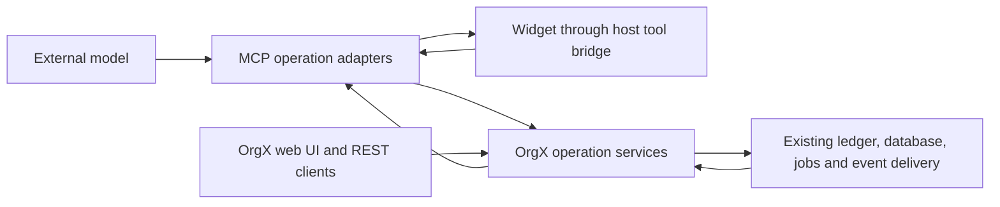

# OrgX MCP tools, domain ownership, and widgets

Status: source implementation record and staged technical plan, updated October 9, 2026. Operation adapters, OrgX services, receipt projections, widgets, extension negotiation, client updates, installer source validation, authenticated session binding, transport observation, and a reconstructed plugin candidate are implemented and locally verified in this task. Required suites passed against the final regenerated catalog; source evidence is stated below. The status table distinguishes existing services, tested new source, rollout work, and remaining domain gaps. These checks are not evidence of deployment, installed-client migration, a successful host scan, or provider approval.

## Recommendation

Use one workflow catalog across ChatGPT and Claude, with **40 core model-facing operations** and a small set of app-only operations for widget interactions. The original 36-tool proposal included one receipt submission tool. Making the complete receipt lifecycle usable adds validation, detail, search, and review-queue reads: four additional tools. OrgX owns work state, policy, execution, proof, receipt identity/storage, and human authority. MCP owns protocol negotiation, client identity transport, discovery, and host presentation.

Use a coordinated cutover for the current single primary user: deploy the core services and MCP catalog, update affected clients, and reconnect hosts to refresh tools and widgets. Historical session inventories, per-client compatibility manifests, and a mandatory inactivity interval are unnecessary. Keep legitimate execution and administration profiles separate from the default workflow catalog. Replacing an action router with another action router does not meet the review finding. The full [before-and-after inventory](../tool-inventory-before-after.md) compares the actual advertised tools.

## Final workflow catalog

The tables define the final product contract; current limitations are stated after each affected workflow and in the implementation status table. Each tool performs one operation; none accepts an action, operation, or launch-mode discriminator. Ordinary filters, target types, and content fields remain data. Workspace context comes from authenticated request/session context when unambiguous; an explicit workspace must still pass OrgX authorization. Writes use stable retry keys where the core operation supports replay, and expected versions where it supports concurrency checks. Current plan saves use version checks and advertise non-idempotence; they do not accept unsupported retry keys. Identity and authority are never model-supplied inputs. A portable receipt can contain producer-declared actors and authority, but those fields never replace the authenticated importing actor or grant OrgX permissions.

### Understand work: nine tools

| Tool | Minimum inputs | Purpose |
| --- | --- | --- |
| `orgx_get_workspace_context` | Optional workspace/initiative | Read workspace context, references, available capabilities, and links. Does not change the active workspace. |
| `orgx_search` | Query or collection type | Find work, decisions, memory, and receipts with typed filters and pagination. |
| `orgx_inspect` | Type and ID | Read one entity and its relevant execution/review context. |
| `orgx_get_operator_brief` | Optional scope and date range | Read the operator chronicle; retire overlapping morning-brief aliases from this profile. |
| `orgx_get_next_actions` | Optional target | Return priorities and actionable blockers, without modifying work. |
| `orgx_get_agent_status` | Optional initiative/agent/run | Read current agent execution. |
| `orgx_get_initiative_progress` | Initiative ID | Read hierarchy progress and gates. |
| `orgx_get_operation_status` | Operation ID | Read a durable operation and linked work/run/review states. |
| `orgx_check_execution_readiness` | Optional workspace | Read credential, capacity, and configuration readiness. |

### Plan and organize: eleven tools

| Tool | Minimum inputs | Purpose |
| --- | --- | --- |
| `orgx_start_plan` | Title; optional initial content | Create a durable planning draft. |
| `orgx_read_plan` | Plan ID, or an explicitly documented latest-active default | Read the draft and revision. |
| `orgx_save_plan` | Plan ID, content, expected version | Save content with a concurrency check and report the supplied edit summary's recording status. |
| `orgx_complete_plan` | Plan ID, final content, expected version | Finalize planning and optionally attach typed targets; does not dispatch. |
| `orgx_validate_initiative_plan` | Typed hierarchy | Validate structure, references, objectives, dependencies, and acceptance requirements; return a digest and findings. |
| `orgx_create_initiative_hierarchy` | Typed hierarchy/digest, or stored proposal/digest | Commit the reviewed structure through OrgX; does not launch agents. |
| `orgx_create_initiative` | Title; objectives when policy requires | Create an initiative without a hierarchy. |
| `orgx_create_workstream` | Initiative ID, title | Add a workstream. |
| `orgx_create_milestone` | Workstream ID, title | Add a milestone. |
| `orgx_create_task` | Workstream ID, title; milestone when policy requires | Add a task. |
| `orgx_update_work` | Narrow work type, ID, nonempty typed patch | Edit initiative/workstream/milestone/task content; cannot change execution, approval, or completion state. |

The hierarchy schema declares stable references, dependencies, owners/domains, objectives, acceptance checks, and proof requirements. Keep the advertised representation compact. Do not include every server configuration field at every nesting level. Current source records that an oversized scaffold descriptor caused ChatGPT to omit the tool. Descriptor size and actual host discovery therefore need verification.

The first implemented atomic hierarchy path is deliberately narrower than that final schema. `McpScaffoldWorkflowSchema` accepts an initiative title/summary, workstreams, milestones, tasks, supported assignments/estimates/deliverables, source evidence, and supported sibling dependencies. It rejects unknown fields before writing. Objective bindings, acceptance/proof profiles, cross-milestone task dependencies, milestone dependencies, and tracker synchronization still require core parity work. Unsupported material must produce a field-level validation error; it must never be silently stripped. Default visibility is private, creation does not dispatch, and unverified source evidence pins the hierarchy to draft. Preserve an explicitly named compatibility operation for richer existing scaffold workflows while those fields migrate.

In the final profile, ordinary critique is performed by the host model. Persisting a revision includes its edit history. Retiring today's `improve` and standalone `record_edit` operations is a product change, not a hidden switch inside `save_plan`. Preserve the five current atomic planning operations in the remediation release. Expose a separate `orgx_request_plan_critique` in an extended profile if an OrgX-run critique remains useful. Guidance that does not edit content can use an explicit app-only feedback operation if that widget behavior is retained.

Current `orgx_save_plan` requires a positive `expected_version`; retrying an update with the old version returns a conflict and requires a read. `orgx_start_plan` supports optional keyed creation replay scoped to the authenticated owner and workspace: an identical active revision-one plan replays, while changed material or a retry after editing conflicts. Unkeyed creates remain distinct, so start and save retain `idempotentHint: false`. The save result explicitly reports whether its separate edit-summary write was recorded. The final atomic text/history requirement is still a core improvement.

### Delegate and control: eight tools

| Tool | Minimum inputs | Purpose |
| --- | --- | --- |
| `orgx_estimate_agent_task` | Existing task or typed proposed task | Return eligibility, likely route, and estimated cost. Never dispatch. |
| `orgx_start_agent_task` | Task ID; optional specialist/constraints | Dispatch an existing task under OrgX policy. |
| `orgx_handoff_task` | Task ID, agent type | Reassign an existing task using the canonical handoff lifecycle. |
| `orgx_launch_initiative` | Initiative ID | Activate executable work, applying approval, budget, and readiness gates. |
| `orgx_pause_work` | Hierarchy level and ID | Stop active work and propagate the pause through the supported hierarchy. |
| `orgx_resume_work` | Hierarchy level and ID | Resume through the canonical recovery/dispatch path. |
| `orgx_retry_work` | Hierarchy level and ID | Retry eligible work, preserving attempt lineage. |
| `orgx_cancel_work` | Hierarchy level and ID; rationale | Cancel through the canonical lifecycle. |

Create-and-dispatch becomes `create_task → start_agent_task`; create-and-launch becomes `create_initiative_hierarchy → launch_initiative`. These are explicit vNext behavior changes. Keep a dedicated create-and-launch tool during parity migration if clients still require it. Permission guarding and model classification become internal calculations of the delegation service; diagnostic profiles may expose their separate operations explicitly.

### Capture and review decisions: three tools

| Tool | Minimum inputs | Purpose |
| --- | --- | --- |
| `orgx_capture_decision` | Decision text; optional title/context | Capture a decision for review and return its authoritative status. |
| `orgx_list_pending_decisions` | Optional scope/urgency filters | Read the pending review queue. |
| `orgx_open_decision_review` | Decision ID | Open the complete human review surface. The person chooses the ruling. |

Current create/remember calls both become generic decision captures through `/api/v1/decisions`; capture does not establish an accepted historical judgment. A historical-judgment feature would need a distinct OrgX capability with provenance. The final opener removes model-supplied approval/rejection intent and ignored note/reason fields. Immediate remediation still needs explicit intent-specific wrappers until that behavior is retired.

### Deliver evidence and close work: four tools

| Tool | Minimum inputs | Purpose |
| --- | --- | --- |
| `orgx_attach_artifact` | Target, title, artifact type, durable URL | Register a deliverable and provenance. In-review registration can emit evaluation events that invoke external model providers and incur costs. |
| `orgx_open_artifact_review` | Artifact ID, or a scoped next-pending selection | Read the review packet and open its widget. |
| `orgx_request_independent_artifact_review` | Artifact ID; typed review constraints | Start an independent review; disclose costs and external effects where applicable. |
| `orgx_complete_work_with_proof` | Work target, typed proof/evidence | Attach proof, verify requirements, and apply the permitted completion transition. |

Completion may return proof recorded with completion blocked or awaiting review. It cannot claim completion until the authoritative state transition succeeds. Content patches and metadata must not provide an indirect route to workflow status, approval, ownership authority, or reserved execution-policy fields.

The new core completion service currently supports **tasks only**. It loads the task inside the authorized workspace, preserves the registered artifact when verification or a version check blocks completion, and commits the supported task transition through the existing work command. Initiative/workstream/milestone completion still needs the corresponding rollup, dependency, event, and side-effect behavior extracted from the existing core lifecycle. The new core endpoint rejects those levels. During migration, the explicit MCP tool preserves existing parent completion through the compatibility path and identifies it with `meta.implementation = "compatibility"`; it must not present that path as the new core service or reduce completion to a status patch.

### Record and inspect work receipts: five tools

| Tool | Minimum inputs | Purpose |
| --- | --- | --- |
| `orgx_submit_work_receipt` | Complete portable v0.1/v0.2 receipt; optional workspace/retry key | Import one receipt through canonical admission. Preserve the document and claims; do not verify, accept, or complete work. |
| `orgx_validate_work_receipt` | Complete portable v0.1/v0.2 receipt | Check schema and reference conformance without storing it. No authentication is needed for this payload-only validation. |
| `orgx_get_work_receipt` | Ledger UUID or opaque producer receipt ID; optional workspace | Read bounded detail, criteria/evidence references, producer claims, separate human judgment, and uncertainty. |
| `orgx_list_work_receipts` | Optional workspace, query, and bounded limit | Search the existing workspace ledger using text and typed filter syntax, without paid embeddings or inference. |
| `orgx_get_receipt_review_queue` | Optional workspace, review kind, and bounded limit | Read unresolved suggestions about outcomes, criteria, mapping, work types, areas, and links. No judgment is submitted. |

Receipt submission is a distinct operation from artifact registration and completion. A receipt saying `succeeded`, `verified`, or `accepted` remains a producer assertion after import. A signed statement of a human intervention also remains an imported statement until its identity and authority are established through the relevant OrgX trust path. Human calls are recorded through authenticated OrgX UI or an app-only token-gated widget operation.

## Other surfaces

The 40-tool workflow profile does not promise full administrative CRUD. Extended profiles must enumerate their tools at connection discovery, without an invocation catch-all or runtime operation catalog.

Examples include objective create/update/pause/resume/complete/archive; start/block/unblock/reopen work; archive initiatives; flag milestone risk; complete several milestone tasks with shared proof; preview/reassign workstreams; publish/unpublish initiative links; update pending decision content; and explicitly configure/synchronize an external tracker. Typed studio, workspace administration, playbook, and skill operations belong in their respective profiles. Public-link publication moves out of generic creation into an explicit publication operation.

`orgx_complete_entity` is the supplemental generic entity completion transition. The established `orgx_complete_work` runtime command retains its task identity, `expected_updated_at`, `expected_aggregate_version`, evidence, and retry contract; these operations must not share an ID or schema.

Telemetry, attention/question transports, event tails, capability leases, provider/runtime diagnostics, and PR consolidation belong in executor/plugin/integration profiles. Hard deletion and force overrides belong in an administrative surface if retained. Human-only protected transitions never become model-callable through a compatibility alias.

ChatGPT and Claude share semantic operation IDs and schemas. Observer profiles expose their permitted reads; executor profiles add the runtime capabilities they actually need. Host metadata and widget delivery vary by client. Legacy routers may remain in an explicitly isolated compatibility endpoint/profile, outside submitted model discovery. Do not hide a supported default-profile operation inside an extension without changing the product contract and migrating its users.

## Ownership boundary

| Concern | OrgX owns | MCP owns |
| --- | --- | --- |
| Operations | Schemas, supported targets, domain validation, policy, transitions, receipts | Tool names/descriptions, fixed-operation bindings, protocol input/output projections |
| Identity | Canonical actor, workspace membership, permissions, persistent attribution | OAuth connection, host identity transport, trusted delegation/session claims |
| Plans and hierarchy | Draft/proposal/executable-plan distinctions; references, dependencies, estimates, assignment, atomic creation | Compact typed inputs, friendly validation messages, widget presentation |
| Execution | Routing, budgets, billing, acceptance, recovery, synchronization, durable attempts | Typed dispatch constraints, host cancellation signals, status presentation |
| Proof | Artifact registration, verification, completion preconditions, human acceptance | Evidence presentation and links |
| Human authority | Existing token issuance/verification, item/person/workspace/version binding, ruling lifecycles | Keep credentials in widget-only result metadata and carry the authenticated click |
| Async state | Durable acceptance, claims, attempts, terminal events and reconciliation | Streams/proxies/caches, reconnects, host polling adapters |
| Rendering | Domain review packets, authorized actions, authoritative projections | HTML/CSS/JS, resource URIs, CSP, Apps SDK metadata, host bridge and themes |

The existing `@orgx/contracts` package and domain registries are the foundation. Extend shared operation contracts rather than introducing another registry database. Keep contracts portable; do not import Next.js server modules into the Worker or widget bundles. Project/generate compatible schemas for the current MCP Zod/SDK versions. Keep domain policy, executable handlers, public tool presentation, and host capability facts in separate modules with explicit dependencies.

### Existing OrgX services to reuse

- Hierarchy: `lib/server/work/initiativeProposalGeneration.ts`, `initiativeProposalStore.ts`, `initiativeProposalCommit.ts`, `initiativeScaffoldCommand.ts`, and `POST /api/v1/initiatives`. The existing proposal/inline-plan paths validate digests and call atomic `create_initiative_scaffold_v1`. The simpler `/api/v1/initiatives/scaffold` endpoint is not a drop-in replacement for all MCP hierarchy fields.
- Lifecycle: `lib/server/lifecycle/iwmtControl.ts` already handles descendant work, active runs, recovery, replacement jobs, and rollback. Pausing a hierarchy is not an entity-status patch.
- Dispatch: `unifiedDispatcher.ts`, dispatch planning, capability eligibility, initiative activation, and queue dispatch already own the execution route.
- Proof: compose existing artifact services, completion verification, acceptance contracts, and work commands in an OrgX service. Recheck completion preconditions and versions there; return already-attached proof on partial failure.
- Human review: `lib/server/decisions/widgetApprovalToken.ts`, `widgetDecisionChoice.ts`, `widgetDecisionDispatch.ts`, and authority services already implement the correct core boundary.
- Async work: reuse existing ledger, `agent_jobs`, runtime outbox and worker infrastructure. Mission-plan generation's reservation/attempt/projection/recovery modules provide an existing pattern for long operations.

The migration needs a parity matrix for objectives, references, dependencies, agent assignments, source evidence, acceptance, proof profiles, defaults, and tracker synchronization. MCP's richer batch path and OrgX's atomic path are not yet interchangeable. Preserve supported behavior in core before removing the batch implementation.

### Source findings that motivate the move

1. MCP `src/index.ts` has 15,409 lines in this checkout and includes scaffold policy, billing checks, creation, dependency handling, launch, and follow-ups. Extract transport registration from business orchestration rather than splitting the file mechanically.
2. MCP scaffold rates are research/create/review/implement = 140/175/155/210 USD per hour, with a 175 default (`src/scaffoldInitiative.ts:131`). OrgX proposal generation uses 90/110/130/150 and a 120 blended rate (`lib/server/work/initiativeProposalGeneration.ts:114`), under the same value-basis label. Estimates need one versioned domain policy.
3. MCP's broad alias maps turn launch on a decision into approve, and pause on a milestone into flag risk (`src/toolDefinitions.ts:2453`). Fixed operations must bypass these maps and use exact supported targets.
4. `src/scaffoldSessionDO.ts` keeps events and completion in memory without Durable Object storage. Current scaffold events are emitted after batch creation. Treat this as presentation delivery, not the durable creation record.
5. OrgX `realtimeOrchestrator.ts:36` stores commands/idempotency in process-local Maps. Do not use it unchanged as the operation-status substrate. Status must load durable state with actor/workspace authorization.
6. `runtimeEventOutbox.ts` can fall back to direct publication and return null. Fast acknowledgment requires a durable accepted request/job/event receipt. Using an outbox helper alone does not establish atomic commit and delivery.

## Receipt architecture and technical contract

### Meaning and independent states

The receipt path needs six separate facts. Do not flatten them into one `verified` or `done` boolean.

| Fact | Authority and storage | What it establishes |
| --- | --- | --- |
| Document conformance | Portable SDK validator | Shape, required fields, resolved local references, and compatible version semantics. |
| Recorded producer assertion | Complete imported document in `execution_receipts.context_used.agent_work_receipt` | What the producer reported about intent, authority, actions, evidence, costs, verification, and outcome. |
| Content/signature integrity | Portable integrity report plus an explicit key/trust policy | Content equality, cryptographic validity, and signer trust, each with its own state. It does not establish that the work succeeded. |
| Independent verification | OrgX-controlled evaluator/proof service and its persisted result | Which check ran, against what artifact/version, by which verifier, and with which evidence. |
| Human judgment | Append-only `work_ledger_decisions` or canonical acceptance/review records | What the authenticated person accepted, rejected, corrected, or called incomplete. |
| Observed outcome | Linked authoritative work/run/result state and measured evidence | Whether the required transition or real-world result happened. Recording a claim is insufficient. |

The new read projection exposes `producer_claims`, `receipt_assessment`, and `human_judgment`. Today imported receipts report `receipt_assessment.verification_status = producer_reported`; human review independently changes `acceptance_status` to `human_reviewed` and supplies the person's outcome. `human_reviewed` does not itself mean a successful outcome. `failed`, `blocked`, and `partially_succeeded` are valid human calls.

Existing import trust policy keeps self-reported success neutral. An explicit self-reported failure can be demotion evidence under `classifyImportedReceiptTrust`. That trust projection still does not set canonical human acceptance, charge authoritative spend, or complete an OrgX task. UI labels must say whose assertion or judgment they are showing.

### Portable v0.1 and v0.2

Use the existing `packages/agent-work-receipt` validator, types, schemas, integrity implementation, and fixtures. MCP's `portableReceiptInput.ts` is a transport projection, not another authoritative receipt standard.

- v0.1 retains intent, actors, declared authority, actions, artifacts, evidence, outcome, verification, costs, timestamps, lineage, human interventions, metadata, extensions, and optional integrity.
- v0.2 preserves v0.1 meaning and adds identified `intent.criteria`, evidence-linked `outcome.criteria_results`, check-to-criterion references, expected outcome ranges/results, provenance with JSON Pointers and confidence, trajectories, and workstream references.
- The core validator enforces unique IDs, resolved criterion/evidence/action references, confidence bounds, expected ranges, and valid provenance paths. A `succeeded` outcome cannot coexist with an unmet required criterion. A producer-declared `met` result still is not an OrgX verification.
- Preserve `org.orgx.review/v1` and other valid namespaced extensions as producer data. Standard metadata/extension slots may contain arbitrary JSON; top-level operation inputs and standard receipt records remain closed. Neither slot selects an operation, grants scopes, or overrides trusted actor identity.
- Do not rewrite opaque producer IDs into UUIDs, drop unknown-but-standard extension contents, invent missing criteria, or upgrade a v0.1 receipt merely to satisfy a widget.

Structural validation and hosted admission remain distinct. Payload-only validation can succeed while import refuses a reserved harness, incompatible PostgreSQL value, quota, or conflicting retry key. Return that distinction directly; never retry through `orgx_write` or the legacy condensed receipt endpoint after an admission rejection.

### Canonical identity, hashes, and chain boundaries

There are three identities, with different purposes:

1. The producer's `receipt_id` is opaque and retained unchanged, with its original actor and external references. External reference identity includes `(system, type, id)`; equal-looking IDs from different systems must not collapse.
2. The ledger row has an OrgX UUID, bound to the authorized workspace and admission record. Detail reads accept the ledger UUID or producer ID, but always constrain lookup to the caller's workspace. Ambiguous producer identifiers need an explicit conflict, not an arbitrary cross-producer selection.
3. The importing actor and any human reviewer are derived from authenticated OrgX context. Portable `actor`, `authority`, `approvals`, and `decided_by` remain producer statements. They never impersonate the importer or settle a protected review.

Keep the two hash scopes separate. The hosted import's `hashAgentWorkReceipt` computes SHA-256 over canonical JSON for the **complete document**, binding retries to its exact value including declared integrity. The portable integrity profile computes the content digest over `receipt_without_integrity`, using RFC 8785 canonicalization, and supports independent signature/trust reports. Changes to signatures can therefore change the import binding without changing the portable content digest. A matching hash establishes content equality, not factual truth or signer authority.

Native work commands already use canonical aggregate versions/events and execution receipts. Reuse that chain for native mutations; do not create a competing receipt database or mutable side ledger. Portable `parent_receipt_refs` and lineage links do not by themselves create a trusted OrgX event chain. The import RPC currently persists an execution receipt; it does not prove every imported lineage edge, fetch evidence, verify external signatures, or append a native work-state event. If imported content participates in a cryptographically checked chain later, add an explicit core verification/reconciliation operation with trusted key resolution, persisted reports, and failure states. Preserve the imported original and append assessments rather than rewriting signed producer content.

### Admission, idempotency, and persistence

`POST /api/v1/agent-work-receipts` is the sole canonical import used by `orgx_submit_work_receipt`. The shared `checkReceipt` and `admitCheckedReceipt` functions are also used by batch import so both paths enforce the same policy.

The implemented path:

1. Authenticate the caller and enforce distributed caller/workspace rate limits; verify workspace membership before writing.
2. Accept bounded UTF-8 JSON only, reject duplicate JSON object member names, and validate the strict import envelope. The existing request bound is 278,528 bytes; portable validation is bounded to depth 64, 50,000 nodes, and 100 reported issues.
3. Validate v0.1/v0.2 semantics, reserved harness names such as `orgx-verify`, and hosted JSONB/timestamp compatibility. NUL values, invalid surrogate sequences, and unrepresentable timestamps produce bounded field-level errors.
4. Canonicalize and hash the receipt. Resolve the retry key from the validated header/body or the default `agent-work-receipt:sha256:<hash>` key.
5. Call the existing `import_agent_work_receipt_with_limit` RPC. It owns atomic workspace quota admission, persistence, duplicate replay, and content-bound key conflicts. An identical retry returns the same stored receipt; reusing the key for another document returns 409.
6. Preserve the complete parsed document in JSONB. Whitespace and object-key ordering are normalized; do not promise preservation of lexical input bytes. Preserve producer economics in the document while authoritative cost/acceptance/outcome projections remain explicitly unverified or awaiting review.
7. Return the ledger and external IDs, schema version, replay indicator, producer claims, assessment, and effects. Effects explicitly say the receipt was stored and that authoritative verification, human acceptance, and work status were not changed.

Admission survives loss of the Worker. Optional signal derivation after import is a separate side effect and must not be reported as evidence that the work passed verification. Future critical projections require transactional outbox delivery or reconstructable replay from the admitted row; best-effort projection failures must not cause a second import or double spend.

### Ledger reads and review learning

The new core `lib/server/workLedger/receiptOperations.ts` composes existing receipt/entity/decision reads with `buildTeamLedger`, `searchLedger`, and `reviewQueue`. These operation reads do not call `getQueryEmbedding`, execute paid model inference, or persist classifier guesses. Separate any existing semantic-search path from these deterministic tools.

The existing ledger window is 120 days, capped at 3,000 receipts, 2,000 records per work entity type, and 20,000 judgment rows. Reads page through database limits before applying these caps. Include the window/bounds in projections and do not describe a bounded result as all historical work. MCP detail returns at most 12 evidence rows and 40 core criteria, with totals; the review extension separately bounds sources, criteria, and episodes at 20 each. The review queue caps its projected results at 200 and exposes truncation and the window. The complete document remains accessible in OrgX. A missing evidence array in the lighter list projection cannot establish that the full receipt has no evidence.

Search supports free text plus exact filters for outcome, verification, acceptance, type, area, repo, actor, workstream, entity, initiative, PR, file, time, confidence, unmet criteria, and status. Results distinguish producer fields from human decisions. A current document's outcome assessment uses only a judgment bound to that exact `execution_receipts` UUID and database-owned `receipt_review_revision`. A database trigger rotates the revision when the stored receipt document changes, including an in-place update, and preserves it for unchanged retries. A newer import with the same producer ID remains awaiting human review; an older document's judgment cannot accept it. Legacy judgments without a reviewed-document UUID remain informational with `scope = "legacy_receipt_identifier"`, while document-bound judgments use `scope = "receipt_document"`. Preserve the original receipt and complete correction history.

The review queue includes uncertain mapping/area/link/work-type/outcome suggestions and proposed criteria. A human outcome correction may propose a criterion, but a proposal is not yet policy. Confirmation belongs in the authenticated OrgX review surface. Do not automatically change another initiative's agreed bar, acceptance criteria, or launch gate from a classifier guess or an imported receipt's review extension. Both public validation and admission now use `validateReceiptDocument.ts` to run core conformance plus the known `org.orgx.review/v1` validator, including cross-references. Other vendor extensions remain preserved data.

### Receipt human authority and widgets

Use the existing decision token infrastructure with the `receipt_outcome` kind. OrgX issues a short-lived token only on the explicitly requested widget metadata channel, with the authorized person/workspace, ledger row and database-owned document revision, current judgment revision, purpose, expiry, and token ID bound into the token. The binding includes `receipt-outcome:<ledger-row-id>:<latest-judgment-time-or-unjudged>:<latest-judgment-id-or-none>:<document-review-revision-or-unversioned>`.

MCP moves tokens to response `_meta`; tokens never remain in `structuredContent`, model text, ordinary read projections, logs, or prompts. An app-only tool accepts the explicit outcome call and token. The core route verifies the purpose, person, workspace, current judgment revision, database-owned document revision, and receipt existence again. A deterministic judgment primary key derived from the token ID makes reuse of the same token single-use at persistence. Authenticated human OrgX sessions can use the normal ledger review route; service/model calls must carry a valid widget token and may not submit other judgment kinds through this exception.

Final review found and fixed distinct-token and document-replacement concurrency gaps in source. `supabase/migrations/20261020110000_atomic_receipt_outcome_decisions.sql` adds the service-only `append_receipt_outcome_decision` RPC over the existing tables. A shared workspace lock coordinates with the import admission RPC's exclusive workspace lock, so an import cannot replace the current document between snapshot comparison and judgment append. A second transaction lock serializes judgments by workspace/opaque external receipt identity. Inside the transaction the RPC checks the latest `execution_receipts` UUID, database-owned document revision, and latest judgment UUID against the signed snapshot, then appends the eligible widget judgment with `reviewed_receipt_id` and `reviewed_receipt_revision` set from that document snapshot. Direct authenticated human outcome calls share the same locks and bind their committed ruling to the selected document, without pretending to represent a stale widget snapshot. Monotonic timestamps preserve judgment ordering even after lock contention or clock rollback. A stale document, stale judgment, or reused token returns a conflict and requires refresh.

The source regression/service tests and selected semantic/lint checks pass. Final verification also passed on real isolated PostgreSQL **17.11**, exercising the actual production outcome and import RPCs: exact document pinning, two-token races, importer-first and reviewer-first races, direct-human serialization, service-only execution, workspace isolation, replay, and monotonic timestamps. A negative control removing the document comparison fails as expected. The reproducible harness is `scripts/verify-receipt-outcome-db.py` in OrgX core, with local fixtures. The migration has not been deployed.

Post-commit learning now loads the committed `reviewed_receipt_id` rather than refetching the latest producer-ID document. The committed review revision is returned by the RPC and retained in the response and proposal provenance. A post-commit reload with a different document revision does not supply that changed packet to criterion learning. The committed document pin is included in the recorded response and criterion-proposal provenance. That final scope passed 20 focused core checks and semantic/lint checks for six selected paths. These checks do not change producer assertions into independent verification or policy. Apply the migration before enabling the new core path; do not fall back to a direct insert when its RPC is unavailable. Per-token primary keys alone do not establish exclusion between different tokens. This change introduces a migration, not a new judgment table.

On expired/stale tokens, refresh the packet and obtain a new token. On an ambiguous network result, read the authoritative judgment before retrying. Append corrections; never mutate the portable signed document to pretend it originally contained the person's call. A token-authorized outcome call is not an execution permission or a command to resume work.

### Atomic signed work-artifact review

`supabase/migrations/20261020120000_atomic_widget_artifact_review.sql` implements `commit_widget_artifact_review` for the **new signed widget route reviewing `work_artifacts` only**. The trusted server argument selects this command; a model payload cannot request that authority. Canonical acceptance material is prepared through the extracted `lib/artifacts/reviewAcceptance.ts`/`reviewCommit.ts` helpers. The transaction locks the workspace artifact, rechecks its exact version and microsecond update time, pending state, evidence snapshot, workspace/project review permission, human actor, and locked-row producer attribution. Acceptance, artifact status, review history, and verification projection commit together. An exception in either write rolls back both. Missing RPC returns a service-unavailable error without legacy fallback or writes.

Source verification passed 73 focused tests, selected semantic checks, lint, and size checks. A disposable native PostgreSQL **17.11** harness also passed real SQL checks for identity/material/permissions, snapshot and terminal-state rejection, both rollback directions, service-only grants, duplicate/unique conflicts, metadata normalization, clock rollback, and both orderings of competing opposite review clicks. This is database execution evidence, not a production migration or live widget result. The reproducible harness is `scripts/verify-widget-artifact-review-db.py` in OrgX core; its `--pg-bin` option supports an isolated PostgreSQL binary directory. No existing production database or global installation was modified.

The atomic command deliberately does not replace generic/policy work-artifact review or draft lifecycle review. Legacy draft review still performs draft CAS, acceptance, and paired-decision CAS as separate operations; it can return a later decision conflict after committing draft/acceptance and can reopen/dispatch rework before that final decision write. Generic paired-decision tokens retain their existing binding, while the dedicated new artifact token binds the exact artifact snapshot. Work-artifact lineage cleanup, shadow learning, and rework remain post-commit effects using existing services; they are not additional writes inside the new acceptance/state transaction. Full reconciliation and consolidation of those effects remain staged work.

## Implementation status and remaining core parity

This records the implemented source and its remaining acceptance conditions. The operation slice's required MCP suites, focused core/source checks, and real isolated SQL tests passed; compatibility follow-up evidence and pending checks are stated separately below. Remaining rollout, broader parity, and host/provider work are listed explicitly. These checks do not establish deployment, provider acceptance, or actual host rendering.

| Area | Existing foundation | New source in this task | Remaining acceptance condition |
| --- | --- | --- | --- |
| Explicit MCP operations | Canonical handlers, security schemes, directory adapters | `src/workflowTools.ts`, fixed bindings, bounded content patches, profile and manifest integration | Required local discovery/output/scope suites pass; authenticated deployed discovery and provider scan remain. |
| Portable receipts | v0.1/v0.2 SDK, canonical admission RPC, execution receipt storage | `src/portableReceiptInput.ts`, `src/receiptOperationTools.ts`, core receipt read/judgment projections, shared core/review-extension validator | Focused import/extension/trust/ledger and required local metadata/schema suites pass. Deploy migrations/core and verify actual host discovery/review. |
| Hierarchy | Proposal store/commit, `create_initiative_scaffold_v1`, native event/receipt command | Aligned strict Worker/core schemas, `mcpWorkflowOperations.ts`, workflow scaffold route | Expand the strict supported subset deliberately: objectives, acceptance/proof profiles, richer edges, tracker/billing and launch parity remain staged. Unsupported inputs fail explicitly. |
| Proof completion | Artifact service, completion verification, task work command | Core `complete-with-proof` workflow route, fixed task binding, marked parent compatibility binding | Focused preservation/gate and required local output checks pass. Extract parent completion/rollups before expanding core target types; real host workflow remains to verify. |
| Plans and context | `plan_sessions`, current planning and scoped entity/decision reads | `mcpPlanOperations.ts`, `mcpReadOperations.ts`, workflow plan/context/decision-review routes | Owner/workspace/version tests pass. Create has bounded optional keyed replay; updates remain CAS, and text/history are two writes with explicit partial failure. Legacy null-workspace plans need a deliberate migration. |
| Human reviews | Append-only ledger decisions, artifact registries/rulings, widget token infrastructure | Implemented receipt compare-and-append/document binding and signed work-artifact atomic transaction migrations | Both real isolated PostgreSQL 17.11 harnesses and source/scoped checks pass, including pinned post-commit receipt learning. Both migrations need deployment; legacy/draft review remains outside the new atomic scope. Real host clicks remain. |
| Widgets | Existing cards, host bridge, CSP and resource registration | Explicit current tool calls, hidden token metadata, updated receipt/proof labels, reconnect links | Build and 140 guidance/widget tests pass, with follow-up receipt/inline/manifest checks. Complete actual host tests; source tests do not establish ChatGPT rendering. |
| ChatGPT extension | Existing global/thread MCP Apps panel and shared host runtime | Advertised current tool IDs with single dispatch, receipt scope/reset guards, reviewed-document/revision binding | 238 tests across 11 extension/runtime/inline suites, JavaScript syntax, and whitespace checks pass. Actual global/thread host refresh, cached resource behavior, and authentic human clicks remain unverified. |
| Ecosystem dependencies | Plugin configurations and instructions, immutable wizard source pins, local MCP/API/Gateway clients | Current named-operation profiles and parsers, source-validated atomic installs from updated immutable pins, portable v0.2 SDK types | Per-client checks cover changed code and instructions. Installed configurations, signed releases, publication, and hosted availability still need rollout smoke tests. |
| Session isolation and observation | Durable Object owner/profile/version binding and existing invocation ledger | Authenticated session lookup, stale-session reconnect, bounded invocation labels, batch/SSE/WebSocket/OAuth observation | Local session/transport checks protect identity, profile, and grants. The persisted actor and canonical grant also protect native SSE sessions that have no SDK initialization marker. Deployed reconnect and enabled-transport smoke tests remain. No old-session inventory or inactivity gate is retained. |
| Long-running operations | `agent_jobs`, ledger/outbox/runtime workers | Adapters reuse current command/run state | A uniform durable operation record, recovery and authorized status service remain a staged core change. Current command/run polling is not proof of universal job durability. |
| Provider package/scan | Published package evidence and three installed skills | `chatgpt-plugin/` reconstructed 1.1.0 manifest, three rewritten skills, matched assets, verifier, reproducible ZIP | Local package checks pass. Compare original publisher identity, deploy tested implementation, create portal minor version, scan, fix findings, and retain actual provider receipts. |

The working catalog has 35 workflow operations plus five receipt operations: **40 core**. The current ChatGPT/v2/directory transition surface has **48 descriptors: 41 model-visible operations** (40 core plus `orgx_record_plan_edit`) **and seven app-only operations**. Current supplemental `extended` and `legacy` inventories contain 68 and 59 tools respectively; installed/specialist profile totals vary with their declared capability. Compute the actual submission count from the authenticated deployed `tools/list` after deployment. Preservation of richer old behavior can require supplemental explicit operations; hiding them before migration is a product-contract change. The implemented workspace-context packet contains authorized workspace/optional initiative and typed references; it does not invent a capability projection.

Final verification is recorded in the [pull request index](../ecosystem-pull-requests-2026-10-09.md). The final MCP run passes 3,000 tests across 263 passing files, with two tests and one file skipped. TypeScript, all 48 source preflight descriptors, browser widget checks, catalog parity and the Worker dry-run bundle pass using the final generated resources and locked dependencies. Core verification passes the full typecheck, all 37 repository invariants, 227 focused tests, the required pre-push benchmark and both disposable PostgreSQL 17.11 transaction harnesses. Client PRs record their relevant parser, configuration, installer, type and build checks; overlapping scopes are not combined into one integrated count. The ChatGPT 1.1.0 candidate passes package verification and reproducible ZIP generation. Worker dry-run bundling does not deploy. No migration, OrgX release, MCP release or provider upload/scan has occurred.

### Checklist for the implemented 40-operation surface

All 40 IDs below are registered explicitly in the current source catalog. “Implemented” means a fixed tool contract and a working binding are present; it does not mean every operation was moved to a new core service, every compatibility path was retired, or a provider approved the deployed surface. Existing canonical handlers still own supported behavior where indicated.

| Operation(s) | Implemented binding | Current boundary or acceptance limit |
| --- | --- | --- |
| `orgx_get_workspace_context` | New core authorized workspace/initiative/reference read | Pure read; capability projection is not fabricated. |
| `orgx_search`, `orgx_inspect` | Existing canonical typed search/entity reads | Actual resource scopes checked; search can record metered allowance. |
| `orgx_get_operator_brief` | Fixed existing operator-chronicle read | Reporting context, not a universal work-state command. |
| `orgx_get_next_actions`, `orgx_get_agent_status`, `orgx_get_initiative_progress` | Fixed recommendation/status/progress bindings | Informational operations retain honest metering annotations. |
| `orgx_get_operation_status` | Existing decision/run/command projection | Returned kind is authoritative; uniform durable operations remain Stage 3. |
| `orgx_check_execution_readiness` | Existing authorized readiness service | Does not estimate by dispatching or start work. |
| `orgx_start_plan`, `orgx_read_plan`, `orgx_save_plan` | New scoped core plan create/read/CAS services | Bounded keyed-create replay; no stale-update replay; edit history is a second write. |
| `orgx_complete_plan` | Core owner/workspace/version CAS completion with bounded attachment results | Completion commits the current text, status and version atomically; attachments run afterward and report individual failures. Completing a plan does not launch work. |
| `orgx_validate_initiative_plan`, `orgx_create_initiative_hierarchy` | New core strict validation/digest and atomic existing hierarchy RPC | Supported typed subset only; richer objectives/proof/edge/tracker parity remains Stage 2. |
| `orgx_create_initiative`, `orgx_create_workstream`, `orgx_create_milestone`, `orgx_create_task` | Individually named fixed entity-create bindings | Initial work creation is separate from dispatch/publication; existing canonical policy applies. |
| `orgx_update_work` | Fixed update with a bounded content schema | No arbitrary state, approval, authority, or execution-policy patch. |
| `orgx_estimate_agent_task`, `orgx_start_agent_task`, `orgx_handoff_task` | Fixed existing estimation/dispatch/handoff services | Estimate cannot dispatch; start/handoff retain costs and exact grants. Uniform recovery remains Stage 3. |
| `orgx_launch_initiative` | Fixed existing launch lifecycle; public initiative reference mapped to canonical target | Existing approval/budget/readiness gates apply; launch can spend and use connected services. |
| `orgx_pause_work`, `orgx_resume_work`, `orgx_retry_work`, `orgx_cancel_work` | Four fixed canonical hierarchy lifecycle bindings | Descendant/run/recovery semantics retained; no generic state patch. |
| `orgx_capture_decision`, `orgx_list_pending_decisions` | Fixed existing capture and queue bindings | Capture/list never confer a human ruling. |
| `orgx_open_decision_review` | New core exact pending-decision read/review packet | Opens the whole human choice; credentials remain widget-only metadata. |
| `orgx_attach_artifact` | Fixed in-review artifact registration | Evaluation events may invoke external providers and incur costs; not acceptance/completion. |
| `orgx_open_artifact_review` | Existing queue/scoped read plus dedicated core explicit-ID artifact read | Explicit IDs support draft/work sources. Dedicated token snapshot and older generic review semantics are distinguished below. |
| `orgx_request_independent_artifact_review` | Existing independent-review service | Can incur model/provider effects; producer cannot choose the authoritative score. |
| `orgx_complete_work_with_proof` | New core task proof/completion binding; marked existing parent compatibility binding | Partial proof preserved; full parent completion extraction remains Stage 2. |
| `orgx_submit_work_receipt`, `orgx_validate_work_receipt` | Canonical core import and shared conformance/review validator | Admission is distinct from conformance, verification, human acceptance, and work completion. |
| `orgx_get_work_receipt`, `orgx_list_work_receipts`, `orgx_get_receipt_review_queue` | New deterministic bounded core ledger projections | No paid embeddings/inference or inferred authority; windows, totals, and truncation disclosed. |

The seven app-only callbacks and compatibility edit operation supplement this checklist. Receipt compare-and-append/document binding and new signed work-artifact atomic acceptance/state are implemented and locally database-verified, awaiting migration deployment. Broader hierarchy/parent/plan and legacy/draft-review parity belong to Stage 2, uniform accepted-operation durability to Stage 3, and catalog curation to Stage 4. Those stages remain pending and have not silently been declared complete by registering the 40 tools.

## Operation and render contracts

Use a shared result vocabulary while retaining distinct operation, work, verification, and human-review states. An accepted request, queued dispatch, worker claim, running execution, verified artifact, and human-accepted outcome are different facts.

For long operations, return a durable `operation_id` with subject references, operation state, structured blockers, retry guidance, and polling information. Small synchronous writes return their committed entity/version/receipt directly; avoid turning every content edit into a background job. Repeating the same retry key and input must address the same operation, while a conflicting payload returns a conflict. A refreshed widget reads the authoritative projection even after the MCP instance disappears.

MCP returns a concise model-visible summary and typed domain data in `structuredContent`. Put view-specific payloads, approval tokens, and widget credentials in result `_meta` where supported. Never put a token that confers human authority in model-visible content. Add versioned widget projections so a tool rename does not force a data-format rename. Derive allowed buttons and their preconditions in OrgX; the widget renders those capabilities rather than inferring permission from status labels.

Annotations describe the operation's actual effects. A review opener does not settle a decision. Dispatch can spend money and touch connected services. Read operations should not silently mutate session/domain state. Existing directory-profile suppression is not automatically applied to ChatGPT, so copying its annotations is insufficient. Keep OAuth discovery and invocation checks aligned and preserve the combined grants required by handoff/launch/recovery.

### Request, output, error, and scope rules

Publish each supported operation's input schema, description, output schema, security schemes, and annotations directly in `tools/list`. A tool may bind internally to an existing handler with a fixed operation value; the input cannot change that value. Parse closed envelopes before forwarding, allowlist fields instead of spreading arbitrary arguments, and validate the projected core body again at the domain boundary. No `action`, `operation`, `mode`, hidden command, arbitrary update patch, or undeclared nested execution selector is accepted for these operation wrappers. Namespaced receipt metadata is data, not a dispatcher.

Use stable operation IDs, a versioned contract revision, actor/workspace context, a target reference, the typed payload, expected versions where needed, and a validated retry key. Context comes from trusted transport claims; never accept a caller-controlled owner, impersonation flag, `force`, approval token in a model tool, or arbitrary service header. An explicit workspace identifies a requested resource and still requires authorization. Read context is different from selecting a new session workspace.

Each operation has a tool-specific success projection and a bounded error projection. The adapter can reuse a canonical operation's exact output contract only when it actually returns that shape. Direct core routes need their own schemas; they cannot borrow an unrelated generic router's successful output. Domain fields must match the generated discovery contract across success, replay, empty, blocked, partial, auth, and provider failure results. Keep secrets, raw upstream logs, internal request/trace IDs, stack traces, and database details out of model-visible errors.

| Condition | Required behavior |
| --- | --- |
| Invalid envelope, duplicate JSON member, or missing required input | Bounded validation error identifying the field; no mutation or dispatch. |
| Unsupported domain field/target/reference graph | 422 with precise findings; preserve the user's material and reject before writes. |
| Missing authentication or required scope | 401/403 with the host's OAuth challenge contract; do not retry using server authority. |
| Missing/foreign resource | Workspace-constrained not-found result without disclosing another workspace's existence or content. |
| Expected-version or content-bound retry-key conflict | 409 with refresh/retry guidance; a new payload needs a new key or refreshed expected version. |
| Evidence recorded but verification/completion blocked | Return the recorded artifact/receipt plus the blocked transition and next required evidence/review. |
| Upstream failure after durable acceptance | Return/read the accepted operation and reconciliation state; do not claim no side effects or start a duplicate. |
| Token expired, reused, or bound to another subject/revision | Refuse the human action, refresh the packet, and obtain a new credential. |

These rules do not require every synchronous result to share every optional field. A common presentation vocabulary can describe `effects`, `subject_refs`, `blockers`, `retry`, and `poll` while keeping each operation's actual data typed. Keep `additionalProperties: false` on closed contract records and permit open producer JSON only where the portable standard explicitly does. Validate outputs at the boundary rather than repairing malformed outputs by inventing success fields.

| Operation family | Scope boundary | Annotation rule |
| --- | --- | --- |
| Receipt validation | Noauth payload-only endpoint | Read-only, closed-world, non-destructive, idempotent. |
| Receipt detail/list/queue; work reads | `initiatives:read`; other reads use their exact domain grants | Read-only if the implementation performs no usage/session write. |
| Receipt import; artifact registration; hierarchy creation | `initiatives:write` plus core workspace authorization | Append-only import is non-destructive and closed-world; explicit public visibility or external publication requires the corresponding open-world effect. |
| Decision reads/capture | `decisions:read` / `decisions:write` | Opening review does not settle it; capture remains a private write. |
| Agent eligibility/status/dispatch | `agents:read` / `agents:write` | Dispatch may spend money and touch connected systems. Existing metered status calls retain `readOnlyHint: false`. |
| Handoff, launch, and recovery | Combined `agents:write` and `initiatives:write`, plus core policy | Conservative effects until each operation's dispatch/cancellation behavior is verified. |
| Human widget rulings | Authenticated user/session or core-issued purpose-bound token, plus exact domain grant | App-only visibility is supplementary; the core authority gate decides. |

Discovery may use alternative grants for a polymorphic read, but invocation must resolve the selected resource and enforce its exact grants. Handoff/launch/recovery keep combined grants rather than allowing either grant alone. A failed invocation must not increase privilege through a compatibility alias. `idempotentHint: true` is justified by the operation's actual replay behavior, not merely by declaring an optional retry-key field.

### Durable jobs, streaming, and status

The eventual `orgx_get_operation_status` reads a core operation record, not Worker process memory. Start with existing native receipts/events, `agent_jobs`, attempt lineage, outbox and worker recovery. Define a durable accepted request before returning `accepted` or `queued`. Its idempotency binding includes workspace, operation, target, normalized input digest, and policy/contract revision.

The intended state machine is `accepted → queued → running → succeeded | blocked | failed | cancelled`, with attempt history and recoverable dispatch/outbox delivery represented separately. A terminal operation can reference work still awaiting human review; operation success must not erase the subject's review gate. Retry creates or resumes the eligible attempt according to the same canonical lifecycle and preserves predecessor/evidence references. Cancellation stops the supported execution but does not delete evidence or turn it into the same cancelled attempt on resume.

Persist command acceptance, effects, event/receipt references, and reconciliation obligations in a transaction or existing atomic RPC. Dispatch/enqueue after acceptance through a durable outbox; a worker records its claim/lease and completion against the attempt. Reconcile expired claims, undelivered accepted commands, cancellation races, and stalled upstream callbacks. Event fanout, a Durable Object stream, SSE, and widget caches are projections. They can disappear and be rebuilt from persisted state.

Authorize every status/read/stream grant against the canonical actor, workspace, and subject. Polling returns a bounded recommended interval; final states stop polling. Reconnect resumes using a durable cursor/sequence where available. The current adapter can continue using typed decision/run/command status while this uniform substrate is completed, but it must disclose which kind of durable record exists rather than manufacture a universal operation ID or durable success.

### Planning persistence and partial failures

New plan reads scope both `owner_id` and `workspace_id` in the database query. A session may be addressed by UUID or `orgx://plan_session/<uuid>`. The documented omitted-ID behavior selects the owner's latest active plan, with deterministic ordering. Reads must not increment versions, update last-used time, extract skills, or persist session selection. Legacy rows with `workspace_id = null` are excluded; migrating them requires an explicit ownership/workspace decision rather than automatic reassignment.

Plan text lives in `plan_sessions`; saves compare `expected_version` and return the new `plan_version`. A content save is distinct from planning completion, acceptance, or execution. Optional create retry keys use a deterministic existing primary key scoped to the trusted owner/workspace and return an identical active revision-one plan; changed content or replay after editing conflicts. Current edit history is a second `plan_edits` write: if it fails after text saves, return the saved plan and `edit_record.status = failed`. Do not roll back the displayed successful text save in prose or retry it with a different key merely to repair history. Atomic content/history persistence and update retry handling remain explicit future work. An unkeyed start can create duplicates, and a stale save does not replay, so conservative non-idempotence annotations remain accurate.

## Widget implications

There is no need for one widget per tool. The same plan card can render start/read/save/complete; the initiative card can render hierarchy creation and launch; the agent card can render dispatch and status.

Define a render contract independent of the tool ID: a widget family, render-contract version, authoritative subject references/versions, bounded projection, supported actions/preconditions, refresh binding, and status/poll guidance. These are the target contract fields; existing packets migrate family by family rather than falsely claiming every widget already returns them. OrgX produces the domain packet and action eligibility. MCP chooses the resource/template and host metadata. Widget scripts render the packet and send typed actions through the host bridge; they do not infer policy from a label or call OrgX with embedded server credentials.

Receipt/proof presentation needs separate rows for reported intent/outcome, recorded evidence, independently checked requirements, and the person's latest call. A producer's verification badge must say producer reported. A reference or hash can be shown as evidence identity, without implying the URL was fetched or its contents verified. Show missing/unmet/unknown criteria, partial results, and links back to the complete record. Receipt validation renders findings; import renders recording; detail/list/review use the same receipt or ledger card. Do not add a new card for each operation.

Recommended app-only operations are the panel snapshot, workspace selection, the existing token-gated decision submission, artifact approval, artifact change requests, receipt judgment, and agent-run resume. Separate plan-feedback submission is optional if guidance without content edits remains a product feature. Register every widget operation upfront with app-only visibility and widget accessibility. Those operations still require authorization and accurate annotations. App-only visibility does not by itself establish human authority.

| Widget | Dependency before this change | Implemented migration and remaining target |
| --- | --- | --- |
| Decisions | `get_pending_decisions` rewritten to `orgx_decide`; `orgx_widget_decide` | Refresh with `orgx_list_pending_decisions`. Preserve token-gated human submission and refusal/refresh behavior. Model opens the whole review, without preselecting approval. |
| Artifact review | `orgx_act` approve/request_changes; separate `orgx_decide` capture | Dedicated app-only signed work-artifact callbacks use the implemented atomic acceptance/state RPC. Generic/policy and draft review remain outside that atomic scope. |
| Plan | `orgx_plan action=record_edit` | Guidance now uses `orgx_record_plan_edit`. Content edits use the scoped versioned save path; atomic text/history remains a core improvement. |
| Scaffolded initiative | `orgx_act launch`; `orgx_widget_decide` agreement | Create and launch are distinct. Launch calls `orgx_launch_initiative`. Preserve the agreement decision and launch its reviewed digest through OrgX. |
| Agent status | `resume_agent_run`; command/run polling | Keep a human resume operation where required; use durable operation status and core run projections. |
| Panel/workspace map | `orgx_bootstrap` for switching | `orgx_get_workspace_context` reads; app-only `orgx_widget_select_workspace` selects. Refresh every projection/grant against the selected authorized workspace. |
| Entity/progress/ledger/receipts | Read tools and live-grant refresh IDs | Rebind canonical read IDs and preserve rendering; use versioned projections and authorized refresh bindings. |

The source audit found a concrete artifact-review mismatch: the widget called `orgx_act` with artifact approval and `request_changes`, although the public router schema did not expose those combinations. Change-request capture omitted the required `decision` field and then attempted another mutation. This task replaces that path with explicit app-only artifact callbacks, a typed core service, server-derived human identity, and revision-bound token checks. Dedicated artifact reads support both draft and work artifacts by explicit ID and bind version plus precise `updated_at` into the click capability. The new signed work-artifact route uses the verified atomic acceptance/state transaction. Older generic decision-review tokens and draft/policy mutation paths retain their distinct snapshot and multi-write semantics, including possible draft/acceptance/rework effects before a paired-decision conflict. Do not claim all artifact review entrypoints are atomic. Source/native SQL tests cover the revised work-artifact flow; actual host interaction remains separate evidence.

Preserve the existing core-issued single-use decision tokens, current-version checks, user/workspace binding, and widget-only metadata split. Apply equivalent authority requirements to artifact and receipt judgments where human acceptance is claimed. A successful HTTP response or returned review URL must not make a widget say approved, launched, or complete; use the authoritative operation and subject states.

This task updates `widgetToolContract.ts`, current read bindings, live-feed refresh bindings, registration metadata, output schemas, surface maps, and profile membership together. The original raw Claude registration and directory-specific auth-discovery lookup require integration checks rather than assumptions that a ChatGPT rename propagates automatically. The shared `chatgpt`/default `v2`/Claude-directory catalog must support every tool its widgets call; host-specific metadata remains appropriate to each surface.

### Coordinated host refresh

Deploy the renamed tools and widget resources together, then reconnect the owner's hosts to refresh imported descriptors and cached scripts. Pre-operation initialized sessions return a non-mutating reconnect error before dispatch. A cached widget missing a current tool can link to OrgX and refresh; it cannot invent a write fallback. This coordinated cutover does not keep historical inventories or wait for a measured inactivity interval.

## Extension and ecosystem rollout

Hosted MCP catalogs, OpenClaw's local MCP server, REST clients, and Gateway execution/continuation receipts are separate contracts. A hosted rename does not rename independent local tools or convert a Gateway terminal receipt into a portable work receipt. Keep operation, widget, Worker, plugin, and portable receipt versions independent.

### Affected clients

| Client | Selected contract after the update | Change |
| --- | --- | --- |
| ChatGPT package | `chatgpt`, current operation catalog | Reconstructed 1.1.0 package uses all 40 core operations; host widgets use seven app-only callbacks. |
| Codex plugin | `commander`, execution/runtime capabilities | Preserve legitimate reporting, command, attention, and concurrency contracts; verify discovery using the configured profile. |
| Claude Code plugin | `read-only`, seven current informational operations | Update names and setup instructions while keeping its narrow status surface. |
| Cursor plugin | `v2`, current operation catalog | Replace router instructions with named creation, planning, execution, decision, and receipt operations. |
| Grok plugin | `v2`, current operation catalog | Update both MCP config mirrors and parse current next-action/operator-brief responses. |
| OpenCode plugin | Gateway/REST plus optional hosted `v2` health reference | Use current hosted discovery where applicable; preserve Gateway continuation. Recompute release signatures through the existing release process. |
| DeepSeek harness | Gateway plus optional hosted `v2` discovery | Use actual discovered operations; preserve the configured URL override and native receipt contracts. |
| OpenClaw plugin | Independent local MCP/REST plus secondary hosted `v2` setup | Keep its local catalog; update fresh hosted configuration. |
| Wizard | Generic `v2`, managed Claude `read-only`, Codex `commander`, Cursor `v2` | Download reviewed current-profile immutable source pins, validate their actual instructions/configuration, and replace managed trees atomically. |
| TypeScript REST SDK | OrgX REST v1 | Preserve full v0.2 receipt fields and body forwarding, including provenance, outcomes, integrity, and extensions. |
| Python SDK, Gateway SDK, local shell | Existing REST/Gateway/native contracts | No hosted-tool rename changes their transport contract; avoid a metadata-only update. |

The ChatGPT extension is the existing global/thread MCP Apps panel and shared widget runtime. The source audit found no separate browser-extension package. Update its resources with the Worker and test both global and thread placement after reconnecting.

### Installer and release behavior

Fresh generic setup selects `https://mcp.useorgx.com/mcp?profile=v2`. Managed clients select the current profile appropriate to their actual instructions. OAuth resource identity stays the canonical unqualified resource; discovery selectors do not change authority. An intentional supported user selector remains a user choice, but this rollout no longer automatically pins a historical catalog to preserve a cache.

Managed downloads pin the new operation-aligned immutable client commits: Claude `099734b` (`read-only`), Cursor `cc2545b` (`v2`), and Codex `150fd9f` (`commander`). Validate those source bytes and their actual configuration/instructions directly; no historical-to-current overlay is applied. Reject conflicting query/header selectors case-insensitively. Prepare the vetted source outside the live tree and rename it atomically only after validation; failure leaves the installed bundle untouched. Restore intended permissions before rename even under a restrictive umask. A source commit is not itself a published or signed package release.

Public profile advertisement and authenticated `tools/list` are useful release smoke checks. Invocation still intersects profile tools with authenticated OAuth scopes and run capabilities; discovery metadata never creates a grant. Doctor must not claim an OAuth tool invocation was tested through an API key. No additional dependency descriptor or inactivity checker is required.

### Portable receipts across clients

Import and validation carry the complete portable v0.1/v0.2 document, including integrity and namespaced extensions. Condensed runtime reporting and Gateway terminal/continuation receipts retain their own endpoints. Do not strip v0.2 fields or retry a failed import as a different receipt kind.

The TypeScript SDK includes criteria and expected outcomes, observations, verification references, cost descriptions, lineage references, provenance, and trajectory steps. Canonical receipt validation remains responsible for numeric/reference semantics. Request-forwarding tests verify the entire document and stable idempotency header. Permission failures return directly. Producer-declared success/acceptance stays distinct from independently authorized human judgment.

### Extension state and authority

The shared runtime validates only `orgx-mcp-operations/1` metadata and checks the advertised current IDs. Workspace selection requires `orgx_widget_select_workspace`; status and receipts use their explicit current operations. Each call dispatches once. There are no legacy aliases, bootstrap selection, missing-tool fallback, or cross-tool retries. Missing descriptors prompt the owner to refresh the App in ChatGPT settings or open the work in OrgX. Host-protocol bridging still supports ChatGPT's different delivery modes; it does not preserve an old tool contract.

Changing workspace clears receipt collections/detail, review capabilities, and related decision state. Generation checks ignore late callbacks, and duplicate receipt submissions are guarded. Display a human result only when `reviewed_receipt_id` and `reviewed_receipt_revision` match the current receipt UUID and database-owned document revision. Host/client metadata and producer actor fields never establish human authority: the core-issued signed capability binds the person, workspace, subject, revision, and expiry. Preserve `orgx.panel.v1`, `orgx.selection.v1`, and Apps SDK 1.1.2. Actual host refresh and authentic human clicks remain rollout checks.

### Current session binding and reconnect

Persist only the resolved profile and wire contract version in `SessionToolContract`. Fresh sessions use the current catalog. Initialized sessions without this binding, invalid contract versions, and explicit profile changes return a non-mutating reconnect error; the owner reconnects without the old session ID. No literal historical inventory is stored or reconstructed.

Look up a session through its authenticated owner before dispatch or metadata projection. Replacing the owner returns 403; stale/profile conflicts return 409. A warm SDK instance retains its cached props and registry, so the trusted lookup also compares its persisted authorization source, OAuth scope set, signed-run identity/workspace, and exact run tool grant. Changed grants return 409 and require reconnect; token refresh with equivalent permissions is accepted without binding credential strings. Internal `full` can never become an external grant. OAuth and run scopes still constrain current registration after Durable Object wake. New discovery versions must change their contract version when a later breaking release changes descriptors.

Automatic aliases are limited to finite, schema-checked compatible reads. Unsupported old writes and protected review calls remain unsupported in the default catalog. Never guess a mutation or map model approval into human judgment. For ambiguous outcomes, reconcile authoritative status and supported idempotency keys before any retry.

The [descriptor review](../mcp-operation-review-2026-10-09.md) caught and repaired a runtime completion ID collision, mismatched legacy output envelopes, and a lost progress output schema. `orgx_complete_entity` names generic completion; runtime `orgx_complete_work` keeps its task/version/evidence contract. Receipt widget calls require signed authority even for stale cached resources.

### Useful observation

Keep the existing `public.agent_tool_invocations` ledger and service-authenticated intake. Record bounded requested, normalized, executed, and registered IDs; profile/version; finite mapping labels; outcome; and recognized action. Unknown labels become `other`. Exclude prompts, arbitrary argument/error text, URLs, credentials, and unknown tool strings. Transport and handler rows merge best effort by session/request/tool; parallel inserts can duplicate, so do not claim exactly-once telemetry. Handshake client identity attributes use and does not grant authority.

HTTP batches correlate JSON/SSE outcomes by typed request ID. Native SSE acknowledgments without a result are attempts, not execution success. WebSocket frames preserve the authenticated actor, profile, and original names. OAuth/run wrappers share this observation path without double wrapping. Keep informational-handler side-effect restrictions and test deployed HTTP/SSE/WebSocket paths after release. Telemetry helps diagnose a stale client; it is not a release gate or a required quiet interval. [The coordinated rollout procedure](../mcp-catalog-rollout.md) replaces the previous retirement census.

Local checks cover changed configurations, instructions, parser behavior, schema contracts, and package builds. They do not establish installed versions, deployed availability, host ingestion, or publication. Keep per-repository validation scope in PRs instead of summing overlapping suites or creating dependency manifests solely for this migration.

## Migration, versioning, and verification

### Stage 1: implemented source slice; rollout pending

- [x] Register fixed default, supplemental, and app-only operations with exact scopes, output contracts, annotations, and widget metadata; isolate old routers in declared compatibility profiles.
- [x] Align current direct Worker/core schemas and reject unsupported richer material explicitly, preserving the named compatibility workflows that still require it.
- [x] Wire scoped context/plan/review reads, atomic supported hierarchy creation, task proof completion, plan persistence, and deterministic receipt projections with trusted actor/workspace and preserved partial effects.
- [x] Migrate widget calls for workspace selection, decisions, plan guidance, launch, status, artifact actions, and receipt human calls; keep authority tokens outside model-visible content.
- [x] Regenerate catalog/submission descriptors and run the local discovery, output, scope, adapter, widget, and freshness checks against the actual registered definitions.
- [x] Implement receipt document/judgment compare-and-append and the narrowly scoped signed work-artifact acceptance/state transaction; verify both with real isolated PostgreSQL and focused source checks.
- [x] Audit actual hosted/local/API/Gateway dependencies; update affected configurations, instructions, parsers, managed source pins, and portable v0.2 SDK types without changing Gateway receipts.
- [x] Implement finite extension negotiation, workspace/receipt state reset, reviewed-subject/human-capability checks, authenticated profile/version binding, stale-session reconnect, and bounded invocation metadata.
- [x] Pass local transport/session and client changed-path checks; refresh affected suites after simplifying the cutover.
- [x] Pass final catalog-parity and source-only preflight for the 48 current descriptors.
- [x] Refresh required OpenAI and MCP/artifact-boundary suites against the final regenerated catalog.
- [ ] Smoke-test deployed HTTP batches, SSE, WebSocket, OAuth and verified-run paths; reconnect the owner's configured hosts and check widgets.
- [ ] Apply the SQL migrations, deploy OrgX/MCP in order, refresh host connectors, run authenticated real-host/reviewer fixtures, and upload/scan the 1.1.0 candidate through the publisher portal. No rollout/provider receipts exist yet.

This slice improves explicit discovery and puts the implemented high-value creation/completion/receipt/plan paths in OrgX. It does not require a wholesale new database, paid dispatch, new embedding index, or replacing existing durable workers. It also does not establish full parent-work completion, richer hierarchy parity, universal operation durability, or provider review clearance.

### Stage 2: consolidate the remaining OrgX policy

Build a field/behavior parity matrix before replacing a legacy orchestrator. Cover goal/objective bindings, references, every supported dependency edge, assignments, source evidence, acceptance/proof profiles, default states, dispatch, budgets/billing, tracker synchronization, rollups, public links, events, and follow-ups. Move each behavior into the appropriate OrgX service with one authoritative calculation. Read-only comparisons can establish parity; never dual-write production mutations for comparison.

Extend the existing atomic hierarchy command or compose durable commands where richer semantics require them. Extract parent completion and its side effects into the core completion service. Unify rate/value estimation under a versioned policy, keeping its basis and version in results. Finish plan create/save replay and atomic text/history if the product requires those guarantees. Move externally visible publication/sync out of generic writes into explicit operations. Expose the new capability only when its schema, authorization, handler, output, and recovery behavior exist.

### Stage 3: make long operations durable end to end

Add the uniform operation projection over existing jobs/ledger infrastructure, transactional acceptance/outbox, worker claim/attempt lineage, authorized reads, and reconciliation described above. Test crashes between acceptance and enqueue, worker restart, duplicate callbacks, timeout/cancellation races, and stale host polling. Streams remain reconstructable. Preserve both the accepted operation and its partial effects when a downstream system fails.

### Stage 4: curate explicit profiles

Release the 40-core catalog and its widget projections as one declared operation version. The current release has 48 descriptors: 40 core operations, one plan-edit journal operation, and seven app-only callbacks. Remove unnecessary duplicate aliases as ordinary product curation. Keep specialized/admin/runtime capabilities in explicit profiles and preserve their actual domain contracts. This stage has no mandatory compatibility waiting period.

Separate portable receipt schema, OrgX operation, widget render, Worker, and plugin package versions. A tool rename does not change stored `agent-work-receipt/v0.2` documents. Update host metadata and resources in the same operation release.

### Deployment order and rollback

Production migrations, deployments, installed-client updates, and publisher upload/scan remain pending. The coordinated release order is:

1. Run required local suites, build generated catalog/widgets, and verify the reproducible 1.1.0 package. Review actual before/after inventories and each changed client PR.
2. Apply migrations `20261020110000` (receipt outcomes) and `20261020120000` (signed work-artifact review), then deploy core services. Verify service-only grants, receipt binding, atomic conflict behavior, and missing-RPC refusal.
3. Deploy MCP with the named-operation catalog and current resources. Verify health, public profile advertisement, authenticated discovery/scopes, stale-session reconnect, and enabled transports.
4. Release affected plugins, SDK, and Wizard through normal version/signing workflows. Validate source pins and atomic managed overlays; exercise fresh setup and changed parsers. Keep independent local/Gateway runtime contracts intact.
5. Reconnect ChatGPT, Claude, and the owner's other affected hosts to refresh tools/widgets. Check global/thread rendering, workspace changes, signed human review, stale capabilities, and ambiguous write outcomes. Pre-operation sessions are deliberately refused rather than retained.
6. Upload the reconstructed 1.1.0 provider draft, run Scan Tools, fix concrete findings, redeploy/rescan as needed, and complete required authentic review fixtures. Report publication/approval only when provider evidence exists.

For rollback, restore a mutually compatible core/Worker/client set and reconnect affected hosts. If a new core operation is unavailable, refuse it clearly rather than substitute a compound write. Retain append-only receipts/judgments and deployed migrations; never widen grants, replay review tokens, or retry an ambiguous write under another ID. For managed client regressions, atomically restore the reviewed previous bundle or stop before replacing the live tree. The operation version identifies the catalog being restored; there is no quiet-window restart or historical-session guarantee.

### Required verification and evidence

| Layer | Checks that justify completion |
| --- | --- |
| Catalog | Unique IDs; 40 core plus declared extensions/app tools; every supported operation upfront; legacy routers absent from submitted model discovery; descriptor sizes and exact output schemas; generated catalog/submission parity. |
| Schemas and authorization | Required fields and closed records; injected discriminator/unknown field rejection; same Worker/core semantics; narrow patches cannot set execution/status/authority; exact OAuth grants at invocation; workspace/owner scoping and cross-workspace refusal. |
| Hierarchy | Valid sibling dependency DAGs, duplicates/cycles/unresolved labels; preserved assignments/details/estimates/source evidence; deterministic digest/IDs; matching retry vs conflicting options; no dispatch on create; rejected unsupported fields cause no writes. |
| Completion | Artifact registered in review; producer verification cannot forge approval; gate failure/stale task preserves proof; completion only after canonical command succeeds; new core rejects parent targets while MCP compatibility is explicitly identified; cost/trust/rollup effects not invented. |
| Plans | UUID/URI and latest-active reads; owner/workspace predicates; read has no writeback; positive expected version; conflicts and saved-text/edit-history partial failure; accurate non-idempotence annotations. |
| Receipts | v0.1/v0.2 semantic vectors; v0.2 criteria/evidence/provenance rules; bounded/duplicate JSON; hosted compatibility/reserved harness; same-key replay/different-document conflict; original metadata/extensions retained; whole-document import hash distinct from integrity hash; producer success remains unverified. |
| Ledger | Deterministic text/filter results; paged DB reads before caps; window/truncation disclosed; separate producer/human fields; no embedding/model request or inference write on operation reads. |
| Human authority | No token in model content; purpose/person/workspace/subject/revision/expiry binding; token replay/concurrent click refusal; model-service judgment refusal without token; authentic human session path; refresh after expiry/stale state. |
| Widgets | Every button invokes a registered current app tool with valid schema; receipt judgment and artifact change requests preserve notes; authoritative status before success text; error/empty/blocked/partial states; refreshed resources; missing-tool reconnect links. |
| Extension | Recognized current metadata and advertised IDs; single dispatch with no cross-tool fallback/retry; workspace receipt/token/decision reset; late callback and duplicate-write guards; reviewed UUID plus document revision; no host metadata as human authority. |
| Ecosystem | Changed client configurations/instructions/parsers and Wizard projections; actual profile/tool/output dependencies; independent API/Gateway boundaries; immutable-source validation; atomic replacement; full receipt forwarding; release signing when applicable. |
| Session isolation | Current profile/version binding; authenticated lookup before dispatch; 403 identity and 409 stale/selector conflicts; no external full grant; exact current scopes; deployed reconnect and refreshed resources. |
| Observation | Enabled transports and rejected/unknown attempts; bounded original-name attribution and merged rows; clients without `_context`; no blind mutation retries or observation-based authorization. |
| Async and host | Accepted-operation survival/recovery and authorized polling where implemented; live authenticated `tools/list`; actual ChatGPT/Claude resource ingestion, CSP/domain/template metadata, refresh, and human clicks. |

Run `pnpm type-check`, `pnpm test:openai-review`, and `pnpm test:mcp-contract` in `/workspace/orgx-mcp`, plus the existing build/widget checks applicable to changed resources. Run focused core route/domain tests and changed-source checks in `/workspace/orgx/orgx`; use the portable package's conformance/integrity/v0.2 suites when its contract is touched. Regenerate artifacts once the registered schemas stabilize and rerun affected checks for further changes. Record commands, scope, counts, failures, and limitations. A passing source suite does not substitute for a portal scan or an actual host interaction, and no live paid agent dispatch is required to verify deterministic contracts.

Run each changed client's existing package/type/meaningful changed-path checks and the MCP `test:mcp-compatibility` session/transport/widget suite. Record their scope in the corresponding PRs. No ecosystem descriptor checker, census, or mandatory inactivity gate remains.

The generated catalog's inline app callbacks now take OAuth schemes and annotations from their actual registered public contracts, rather than a second abbreviated declaration. Pure payload-only receipt validation correctly declares no authentication. Catalog freshness/parity passed seven tests, including full security/annotations comparison, and source-only preflight passed all 48 descriptors while recognizing that deliberate no-auth contract. These results are not authenticated hosted discovery or provider scan evidence.

Measured input schema sizes differ between flattened submission artifacts and actual SDK discovery: hierarchy is 3,304 bytes flattened and 3,403 bytes in SDK form; portable receipt submission is 45,029 bytes flattened and 21,365 bytes with SDK references; SDK receipt validation is 20,870 bytes. Record these as concrete host-ingestion review inputs. Local registration and schema tests establish the emitted contracts, but no authenticated host ingestion/omission result or provider size clearance has been observed. Validate the actual deployed descriptors and reference handling through host refresh and Scan Tools rather than inferring a limit or clearance from local byte counts.

## Plugin package source and portal review

The portal plugin ID is `plugin_asdk_app_6a1083cac4788191a47b657dc58c4315`. The October 5 provider audit records published package **1.0.0**; its next minor package version is **1.1.0**. The integrated MCP source package is **1.1.7**. The earlier remote registry release **1.1.6** fixed registry description length. The separate local Codex package is **0.1.22**. These are different version streams. The MCP `scripts/release.sh minor` would bump its own server version and commit/tag; it does not create portal package 1.1.0.

The package search found [an OrgX source bundle in `hopeatina/openai-plugins`, branch `codex/add-orgx-plugin`](https://github.com/hopeatina/openai-plugins/tree/c868b33ff252f016a048fcacd12bc9e9eeb73aa9/plugins/orgx), absent from that repository's default branch. It contains `.codex-plugin/plugin.json`, `.mcp.json`, assets, verification script, and the three matching skill names. Its manifest is **Codex 0.1.2**, not the published ChatGPT 1.0.0 manifest. Preserve that provenance instead of calling it the latest portal ZIP.

The currently installed ChatGPT skill contents were recovered through their cloud package. `orgx-deviation-reporting` matches unchanged Codex source; `orgx-initiative-ops` and `orgx-runtime-reporting` match the pre-October-1 Codex snapshot, including `67ab65d` and `ab5d7707d2052ce1ffadfd2020a3d6eac65e4424`. Current local skills include later authority/status guidance. The published portal manifest/ZIP itself has not been recovered from the accessible filesystem or inspected GitHub branches/releases. `chatgpt-app-submission.json` is the listing/annotations/tests source and contains no plugin package version.

The task now includes a locally verified reconstruction in `chatgpt-plugin/`: portable root `plugin.json` at version **1.1.0** with its required schema and `extensions.com.openai.interface`, auto-discovered `mcp.json` using `streamable-http` and the recorded published `/mcp` URL, three rewritten skills referencing the 40 core operations, matched first-party artwork, and Python standard-library validation/build scripts. The ZIP is `artifacts/orgx-chatgpt-plugin-1.1.0.zip` and is excluded from version control. Local validation checks eight archive files, component paths, known manifest fields, starter prompts, skill references, PNG assets, potential credential patterns, and reproducible archive bytes. The current [plugin submission documentation](https://developers.openai.com/plugins/deploy/submission) distinguishes portable root and Codex formats. The candidate uses only portable fields, a subtitle within 30 characters, all four MCP listing URLs and no Codex shadow declarations. Its known published connection URL is preserved because the current portal update flow does not support changing that URL. Publisher identity/metadata are reconstructed and still require comparison with the original portal record; the ZIP is not represented as an export of 1.0.0.

The submission sequence is:

1. Recover/export the actual portal package and preserve its publisher identity, enabled surfaces, asset paths, permissions, MCP connection, and supported extensions. If a new source package must be reconstructed from installed skills and verified metadata, label it as a reconstruction and validate the actual current package schema before upload.
2. Build a reviewable package **1.1.0** with accurate updated skills and workflow guidance. Validate JSON paths, assets, starter prompts, declared components, and the absence of credentials/internal local runtime files. Keep package metadata validation separate from hosted tool discovery.
3. Apply both tested SQL migrations in order (`20261020110000` receipt outcomes, then `20261020120000` signed work-artifact review), deploy OrgX core, deploy MCP, verify health/authenticated profile discovery, and refresh host connectors before uploading the package and running the portal's actual draft/version and **Scan Tools** workflow. The new core source fails closed when its RPC is unavailable; changing the deployment order is not a fallback strategy. Retain migration/deployment, version, and scan receipts and the complete findings list. A local manifest or test pass is not a scan result.
4. Fix concrete scan findings in actual IDs, descriptions, schemas, annotations, scopes, registration, widget metadata, or resource delivery as applicable; redeploy and rescan. Preserve conservative risk hints when an operation has those effects.
5. Complete enabled-surface review fixtures, authentic UI/demo evidence, and provider-required reviewer access. Submit for review when the concrete version is ready. Approval and publication are separate provider states; report only states established by receipts.

The current user-supplied findings require separating operations behind `manage_lifecycle`, `orgx_write`, `orgx_act`, `orgx_plan`, `orgx_spawn`, `orgx_decide`, and `approve_agent_work`, and replacing misleading decision tool names. A title-only fix from the older October 5 audit does not address that newer finding. `scaffold_initiative`'s message says further review is required without a specific defect; do not claim that a schema refactor guarantees its clearance. Residual generic holds require the provider review path after concrete defects are fixed.

The available plugin management tools expose installation/search/permissions, not publisher package upload/version creation or provider scans, and the execution environment has no established authenticated portal session. This is an **access/tooling blocker for external scanning**, separate from the identified source issues and from any provider rejection. Deployment and the provider scan remain pending, and no deployment receipt exists. Continue the authorized source/local verification work; never fabricate a created version, deployment, or cleared scan.
