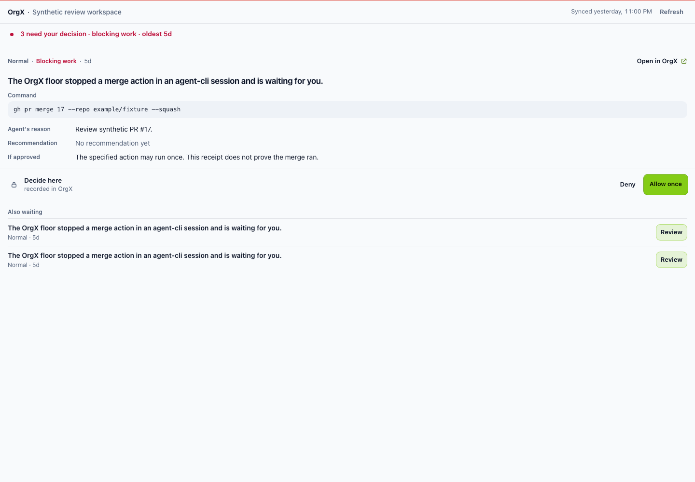
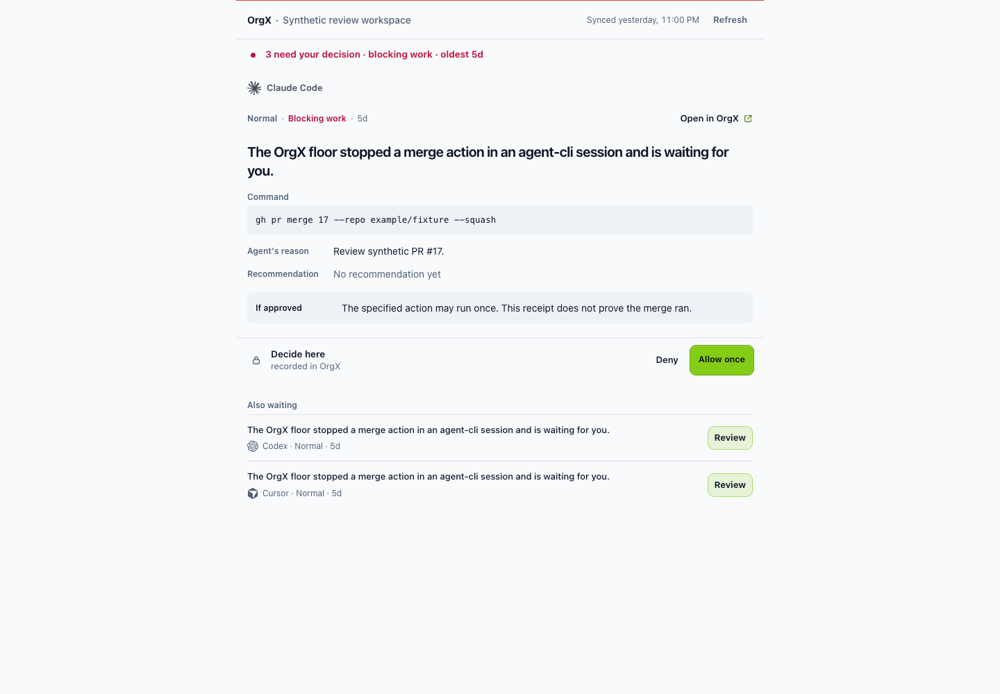
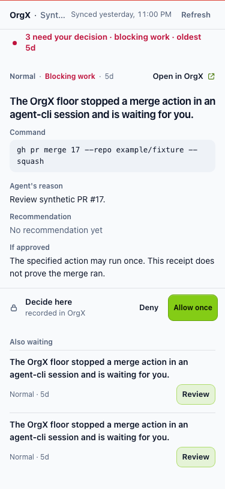
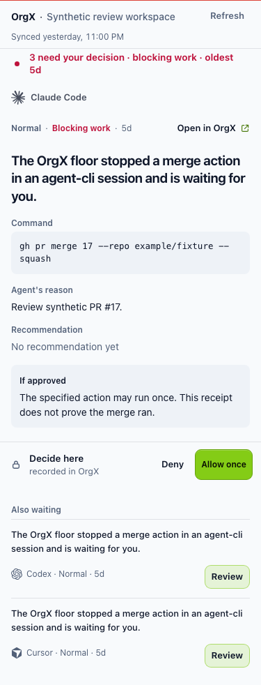

# Extension visual follow-up — 2026-10-07

## Design brief

MCP widget / Action / Escalation / Needs You / returning reviewer. The first-glance
question is: which action needs my permission, from which reported client, and
what happens if I allow it? Journey: Decide → Prove → Continue.

Existing: one selected packet, compressed queue, typed read/settlement contracts,
workspace-local state, explicit status and recovery. Missing: originating-client
projection, distinct request titles when floor summaries repeat, mobile header
space, and typographic separation between consequence and incidental metadata.
Canonical data owner: pending-decision read → `orgx_panel_snapshot`. Action owner:
existing `orgx_widget_decide`. All actions, scope guards, and navigation stay on
those existing paths.

Chosen: one continuous host-appropriate surface with reported client identity,
selected question, inset command, highlighted consequence and restrained queue.
A two-column dashboard would weaken the packet on narrow embeds. Equal request
cards would multiply primary actions. Logos remain secondary to OrgX and are
paired with readable client names; missing/unknown clients have a text fallback.
No client is inferred from model/provider names, the host, or arbitrary prose.

Required states: cold/loading, delayed selection, empty, long, degraded/offline,
permission-limited, urgent, recorded/confirmed/rejected, and calm. The footer
continues to distinguish approval from execution and uncertain settlement.
Visual follow-up is a draft; merge approval applied only to #468 and #469.

## Implementation and evidence

The pending-decision read companion is
[hopeatina/orgx #3361](https://github.com/hopeatina/orgx/pull/3361). It projects
only recorded `source_client` / `harness` into existing scoped read context.
This worker carries that optional field through the canonical panel schema.
Older app responses remain compatible and show “Client not reported.” Client
names are reported provenance, not independent host verification.

Known client marks are bundled locally and paired with readable names in the
selected packet and queue; [asset sources](client-brand-assets.md) are recorded.
The request gains typographic prominence, “If approved” has a quiet inset, queue
titles recede, and the surface has a 760px reading limit. The phone header keeps
the workspace and 44px Refresh together, with freshness on a separate line.
Long workspace names wrap rather than disappear behind an ellipsis.

The readable controller and stylesheet now live in `public/widgets/controllers/`
and `public/widgets/styles/`. The existing build embeds their minified contents
and validates both source markers. No extra widget request or dependency is
introduced. The inline shared state bundle remains the canonical state helper.
The existing 515KB panel payload limit is preserved.

Before: merged MCP main `1ae98d152fd55aff96c8c18aa5b2ce397149910f`.
After: this branch. Both use the same **offline synthetic** decisions and client
identifiers; displayed merge commands are never executed.

| Before | After |
| --- | --- |
|  |  |
|  |  |

## Local verification and critique

- Six light/dark renders at 1440, 768, and 375px: zero overflow/page errors,
  no calls, no reduced-motion animation; logos have decorative semantics and
  readable names. Keyboard Tab reaches Refresh, which stays with workspace on
  the phone. Missing/unknown identifiers switch to text without rendering raw
  identity strings or a guessed mark.
- Eight existing theme cases include 200% zoom: all pass, with no visible
  control below 44px. Sampled contrast minima: 4.92 light / 6.10 dark. This is
  sampled token contrast, not full WCAG or screen-reader certification.
- Four settlement renders plus ten phone states and lost-response recovery
  retain the existing duplicate-write, keyboard disclosure, and no-replay checks.
- Full local unit/contract/browser suite: **242 files passed, 1 skipped;
  2,589 tests passed, 2 skipped**. Type-check and bundle build passed.
  Descriptor snapshots change only `orgx_panel_snapshot` for its optional
  provenance field. The live-QA harness still evaluates shipped code and now
  recognizes controller source attributes and its declared state dependency.
  Exact-head CI is recorded in the PR.

Local screenshot judgment against the repository rubric:

| Dimension | Score / 100 |
| --- | --- |
| Signal clarity | 84 |
| Hierarchy | 90 |
| Actionability | 92 |
| OrgX distinctiveness | 82 |
| Quiet-state composure | 94 |
| Motion | 90 |
| Accessibility | 90 |
| Implementation discipline | 90 |

Weighted total: **88/100**. These are local design judgments, not empirical
two-second usability measurements or an external creative-model review.
The selected request wins the squint test; the consequence is easier to find;
the colored attention rail still dominates urgency. The healthy fixture
compresses to workspace, freshness, quiet status and the last accepted receipt.

Remaining debt: repeated generic floor sentences still obscure the specific
action/target, missing recommendations need a useful reason, and aggregate
unaccepted-work counts need a direct destination. These require their upstream
owners rather than parsing command strings into invented request titles.
Native ChatGPT web/mobile acceptance is not claimed; foreground UI was not used.

Reproduce with `node scripts/audit-panel-visual.mjs`,
`ORGX_PANEL_AUDIT_FIXTURE=tests/fixtures/panel-visual.json node scripts/audit-panel-experience.mjs`,
and `WIDGET_THEME_WIDGETS=orgx-panel node scripts/audit-widget-themes.mjs`.
