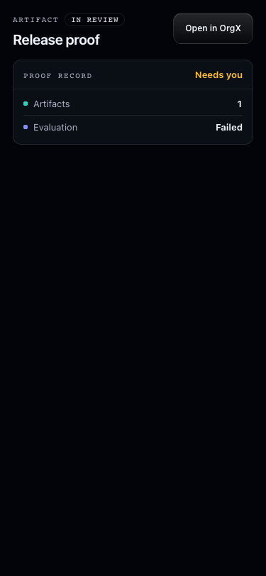
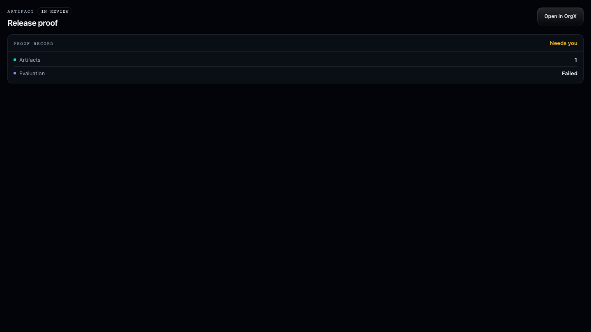
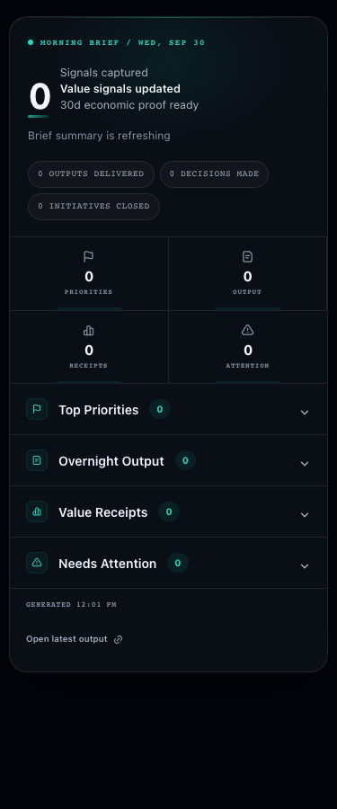
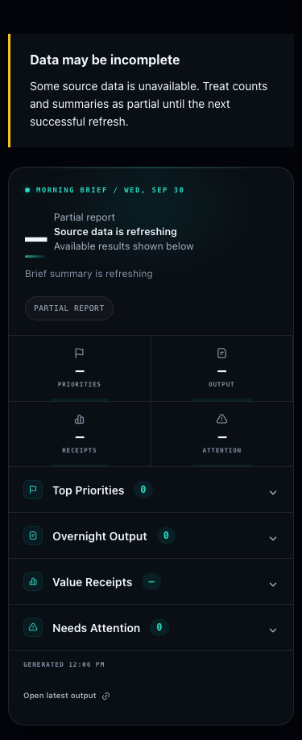

# MCP reliability and widget audit — September 30, 2026

Audit window: September 16 at 00:00 CDT through September 30 at 10:30 CDT.
Production surfaces: `orgx-mcp-production`, `https://mcp.useorgx.com/mcp`, and the canonical OrgX API.

## Evidence and limits

The persisted `agent_tool_invocations` ledger contains **868 successful and 103 failed MCP-worker records** in this window. The [aggregate export](mcp-audit-2026-09-30-aggregates.json) includes tool names, classifications and latency only, with no arguments, identities, credentials or private response bodies. These are recorded invocations, not a claim that every transport attempt was retained.

The signed-in Cloudflare dashboard exposed the retained seven-day window. Samples include canonical identity/credential 401s, a September 27 upstream 502 and a September 28 Durable Object reset during deployment. Cloudflare explicitly marked these queries as sampled/incomplete under high volume; its displayed counts are not exact totals. Earlier raw events cannot be recovered from the dashboard because [Workers Logs retains at most seven days](https://developers.cloudflare.com/workers/observability/logs/workers-logs/#limits). The first week is therefore covered by the persisted ledger, not raw Cloudflare stack traces. The installed Cloudflare connector still returned `Unexpected response type` and Wrangler's saved OAuth login was expired; the authenticated dashboard was the usable Cloudflare source.

Claude Code used its connected production OrgX MCP, with existing permission hooks retained. Two read-only passes exercised retrieval, pagination, inspection, reporting, memory, planning, continuity, review queues and dispatch preflight. No business work was dispatched and no approval or paid provider execution was triggered. Claude's global reporting hook emits session records; those records are not proof that the reads dispatched business work. Large/raw tool responses remain local and are excluded from commits and PRs.

## Reproduced defects and changes

| Defect | Production evidence | Core repair |
| --- | --- | --- |
| Morning brief rejected a valid result | SDK `-32602`, unrecognized `generated_at` and `data_gaps` | Declare producer-owned fields and nullable no-session fields; test the strict SDK result. |
| Initiative pulse rejected a live result | SDK `-32602`, unrecognized `live` | Derive typed live-grant support from the existing feed registry for published tools and aliases. |
| Widgets masked tool errors | An error payload rendered “Nothing to show here” on the entity card | Preserve MCP `isError`; display an accessible shared error state; reject failed action results; restore content after a successful result. |
| Failed artifact evaluation remained “verifying” | An in-review artifact had `verification.eval.status=failed`, score 0.2, threshold 0.8 | Failed evaluation takes precedence in proof verdict and appears in the proof rows. |
| Reporting response duplicated an entire chronicle | Claude received about 143 KB for a day and 169 KB for a week | Remove only identical HTTP compatibility aliases at the MCP boundary; retain distinct snapshots and unrelated fields. |
| Agent handoffs repeated full instructions per surface | Seven agents each carried eleven copies of a base handoff | Keep one `primary_prompt`; surface instructions reference it. All surface names, counts and links remain. |
| Task handoff lost authored criteria | Task metadata contained three criteria; frame and work-context criteria were empty | Companion OrgX change admits authored acceptance criteria into the shared Goal Frame loader. |
| Workspace recommendation timed out | Six persisted failures around 30 seconds; two repeatable Claude failures | Companion OrgX change replaces serial hydration of up to 50 initiative graphs with a pool bounded to six. The workspace currently has 207 active initiatives. |
| Degraded brief rejected its reason array | Second production replay: `Expected boolean, received array` at `degraded` | Match the shared backend degraded-payload contract: boolean or reason array. |
| Task prose inflated status previews | Seven agents' lists repeated full task descriptions and metadata | Bound descriptions to 360 characters, preserve all task rows, expose explicit truncation/detail flags and inspection calls. Production replay confirmed all 98 nested task rows carry the flags and correct inspection calls. |
| Partial reports looked complete | A valid degraded brief returned a timeout shell without a visible availability notice | Shared runtime now labels partial data in every widget while retaining usable results and clearing the notice after a successful refresh. The brief hero uses unavailable markers instead of zero/proof claims; output previews are labeled as shown and pending decisions are not called resolved. |
| Scored next action was erased | Post-core-deploy calls returned five recommendations but `next_action=null` | The guidance sanitizer now distinguishes semantic recommendation objects from tool-call breadcrumbs, preserving the recommendation while still validating nested calls and profile visibility. |

## Other logged failures

Authentication requirements, absent entities, invalid enum/required inputs and the direct-human decision guard are expected refusals. They must remain clear errors. Historical plan-session inspection/completion and spawn-contract failures have recent independent fixes on main (MCP PRs 424, 421, 417 and 416); current plan-session inspection was retested successfully through Claude. A product controller status call reports that its controller is not implemented; this audit does not invent controller functionality. Polling requires an actual question/attention ID, so its successful production path cannot be certified without creating or discovering one. The one sampled upstream 502 is retained as an incident signal; there is not enough trace evidence to attribute it to a new application defect.

## Call and rendering coverage

| Family | Functional assertions | Evidence boundary |
| --- | --- | --- |
| Bootstrap/context | Workspace, granted scopes, capsule and sequence | Live Claude production reads |
| Search | Count equals array length; typed next page has new IDs and correct offset | Live Claude plus pagination/retry browser checks |
| Inspect | Initiative, task, decision, artifact, run and canonical plan-session shapes | Live Claude; failed-evaluation projection has deterministic regression and widget proof |
| Reporting/status | Agent counts and bounded artifacts; brief/chronicle shape; pulse live grant | Live Claude before failure and strict SDK regressions; repeat after deployment required |
| Continuity/memory | Tail base verified; ordered events; query/recall return typed results | Live Claude production reads |
| Review/decisions | List pending, review artifact, list review packets | Live reads; action failure handling tested without applying production decisions |
| Spawn/scaffold/actions | Estimate/guard/route states, accurate “no dispatch” copy; action error propagation | Live preflight plus deterministic SDK/browser fixtures; no business dispatch |

The visual change uses the existing widget foundation and semantic theme tokens. Its state matrix covers initial failure, failed action, long error text, temporary null host hydration, successful recovery and failed artifact evaluation. The existing eleven tool-backed widget layouts retain their retrieval/reporting/creation roles. `scaffold-streaming.html` is a separate standalone simulation, covered by the existing gallery audit.

Local checks: `pnpm verify`; **1,701 passing full-suite tests**; **80/80 host render checks**; **160 gallery/layout checks, zero failures**; **132 error/overflow/recovery cases** at 1440/768/375 in both themes; **28 payload/pagination/disclosure cases**. No new horizontal overflow was found. Keyboard disclosure/pagination behavior is included in the existing payload harness. Raw production content is not in screenshot fixtures.

## Screenshot proof

Same synthetic failure, before and after at 375px:

Failed evaluation shown at 375px and desktop:

Merge, deployment and production replay evidence must be recorded separately after required checks pass. Local checks and these fixtures alone do not certify production behavior or every mutation path.

## Follow-up verification

[MCP PR 426](https://github.com/useorgx/orgx-mcp/pull/426) merged as `f1885ea00f904285c25d83394004558003ebaa68` and [deployed successfully](https://github.com/useorgx/orgx-mcp/actions/runs/36742676286). [MCP PR 427](https://github.com/useorgx/orgx-mcp/pull/427) merged as `0f97962c7865ab1ff7207f8a395136285c064a0a` and [deployed successfully](https://github.com/useorgx/orgx-mcp/actions/runs/36746090297). Production error/overflow/recovery checks passed 132/132 after both deployments. Claude's post-deploy brief and pulse calls accepted the previously rejected fields; inspection showed the failed artifact as “Needs you” with “Evaluation: Failed.” The chronicle retained one root snapshot without an identical compatibility alias.

Claude initially inspected status fields at the agent level rather than the nested task arrays. Its corrected structural check found 98 task rows, 62 unique task IDs, maximum description length 360, 98 explicit truncation flags, 98 detail flags and 98 correct task inspection calls. Seven agent records match `summary.total`, and the four undispatched aggregate values match their summary counterparts. Status is still about 113 KB because identities, artifact previews and compatibility lists remain; Claude successfully delivers this through its saved tool-result file. A large-result file is not a server error, and the audit does not claim an inline token limit guarantee.

The final partial-data follow-up passed `pnpm verify`, 1,713 full-suite tests (two skipped), 132 partial-data/overflow/recovery cases and 36 real Claude read-payload render/projection cases across nine widgets, desktop/375px and both themes. Raw read payloads were exercised locally and remain excluded from commits. The full suite first hit one unrelated five-second test timeout under simultaneous browser load; it passed with two workers without changing that test or its timeout.

Partial brief, before and after at 375px:

The core changes are in [OrgX PR 3248](https://github.com/hopeatina/orgx/pull/3248). Its required CI, smoke, ratchet and all six fallback test shards passed before merge. Its application deployment and the final production recommendation/criteria receipts are recorded in that PR separately.

Core production receipt: [deployment 36746317944](https://github.com/hopeatina/orgx/actions/runs/36746317944) passed, and `/api/v1/health/live` served release `37b7d682f483d96b8cbbbb89f0165ceab506fa49`. Two Claude next-action calls returned five real recommendations, explicit ready/blocked states and no timeout. Task inspection preserved all three metadata criteria in the Goal Frame, decision brief and session work context. The brief still declares `brief_route_timeout` while its independent attribution and workspace-metric sources return usable data; the partial-state UI therefore remains necessary.
