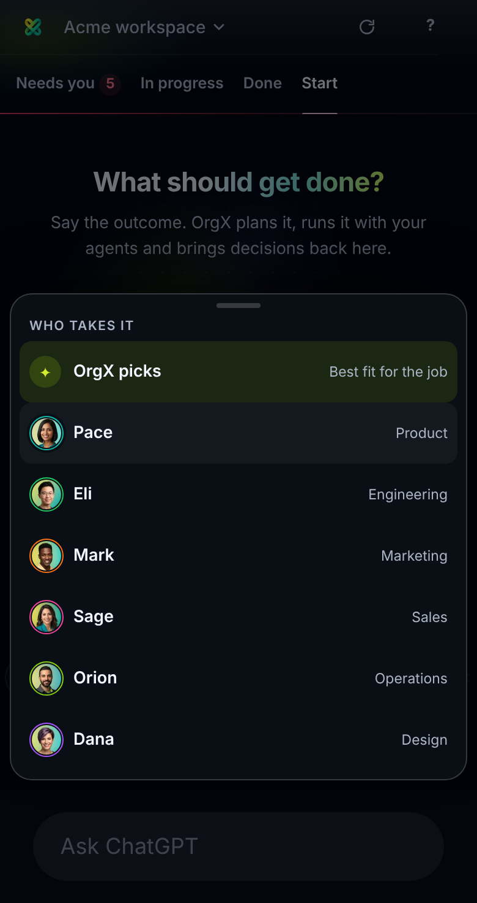
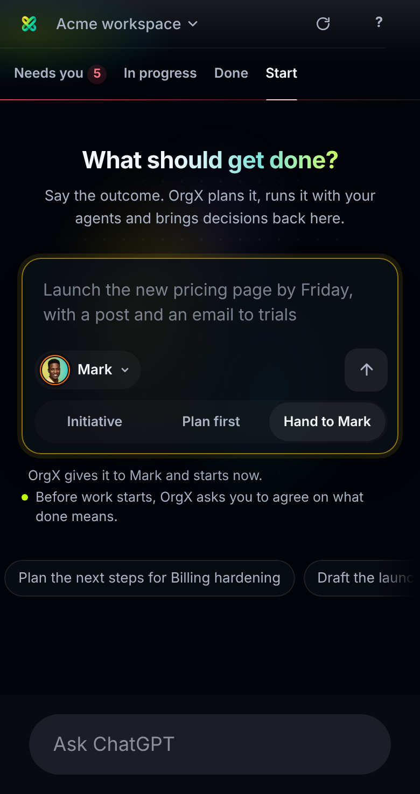
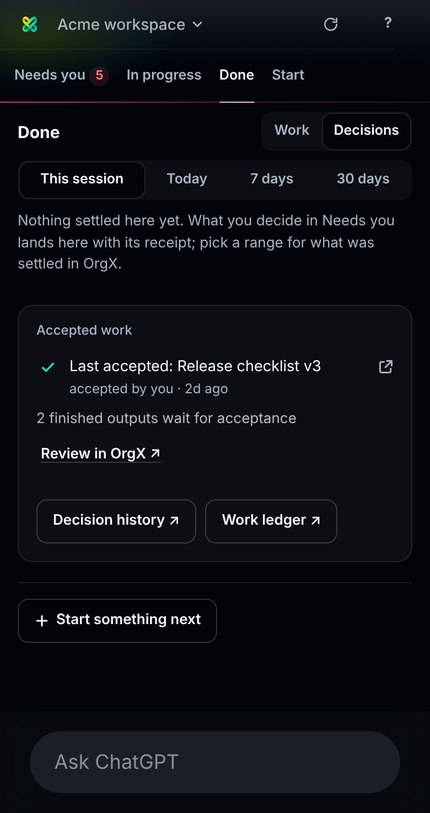
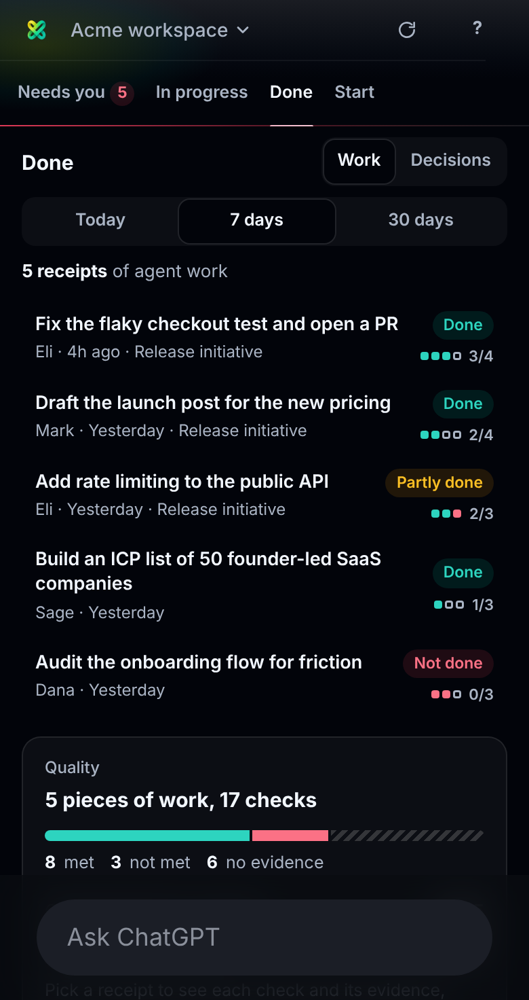

# OrgX panel: a detail pass from phone captures — 2026-10-10

Sixteen captures from the ChatGPT iOS app and from the useorgx.com pages the
panel links out to (Safari in-app browser and Chrome). This note covers the
panel's share; the web pages' share is a separate pull request in the app
repository (artifact page evidence styles, review sheet copy and tone, task
page owner and outputs, initiative workstream row).

## What the captures showed, and what changed

| Capture | Problem | Change |
| --- | --- | --- |
| Start, "Who takes it" open | The menu dropped down under ChatGPT's composer; the last agent (Dana) sat behind it. | On a phone the menu is a sheet on `<body>`, rising above the host's composer floor with the page dimmed behind it (`panel-app.js` `sheetMenu()`, `.pn-sheet*`). The menu element itself moves there, so its buttons keep their actions and the shared click handler. |
| Start, after a send | The composer reset to "OrgX picks" / "Initiative" once ChatGPT re-created the widget. | Who takes it and how persist in `localStorage` (`orgx.panel.start.v1`) and are restored on mount. The sent text still clears. |
| Start, after a send | ChatGPT answered "I'll check OrgX for the pricing details and Mark's agent record…" and called the status tool, never the handoff. | The sentence asks for the handoff outright: "In OrgX, hand this to Mark (Marketing) and start it now: …" (`panel-start.js` `sentence()`). |
| Done › Decisions | The lens and range controls were right-aligned and wrapped differently in Work and Decisions, so the controls jumped when the lens changed. | Under 640px the lens sits by the heading and the range takes the next row, evenly divided and left-aligned (`.pn-done .dn-ctl` container rule). |
| Done › Decisions, This session | "Decisions you settle here collect as receipts…" read as a slogan. | "Nothing settled here yet. What you decide in Needs you lands here with its receipt; pick a range for what was settled in OrgX." |
| Done › Work, read failed | "Work receipts could not be read right now. Try again" and a tall empty view. | The notice also offers "Open the work ledger ↗" (and "Open decision history ↗" for the Decisions lens). In full screen the page fills the viewport (`min-height: 100dvh`), so a short view no longer ends above the host's background. |
| Tabs | "Done 0" next to "2,554 finished outputs wait for acceptance". | Done shows a count only once something was settled in this session. |
| Needs you, Your queue | Two floor approvals that differ only in a worktree path showed `cd ~/Code/orgx-worktrees/mcp-sc && …`, truncated before anything else. | Grouped rows whose commands share a long start show from where they differ: `…/mcp-sc && git merge --ff-only origin/main`. The whole command is the row's title attribute. Short commands (`gh pr merge 3236`) keep every word. |

The panel's payload budget grew with the new CSS and code
(`scripts/widget-payload-budgets.json`: 732,160 → 741,376 bytes).

## Captures (Chromium, 390×736 view, ChatGPT phone profile)

| | |
| --- | --- |
|  |  |
|  |  |

## Still to look at on a real phone

- The fullscreen fill: the captures showed ChatGPT's own background below a
  short view; `min-height: 100dvh` on `<body>` and the panel should close that
  gap, but only the app can confirm the iframe's height.
- "Recommendation · No recommendation yet" on a decision card is deliberate
  (no recommendation is information) but reads as noise at a glance; left as
  is for now.
