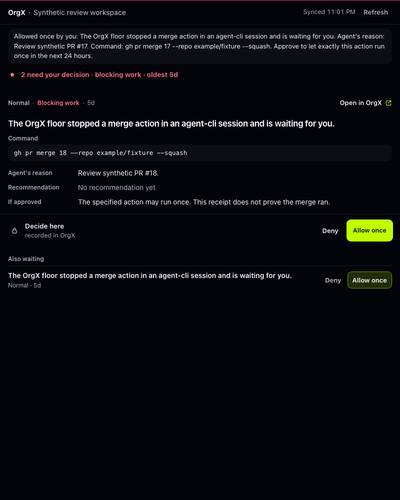
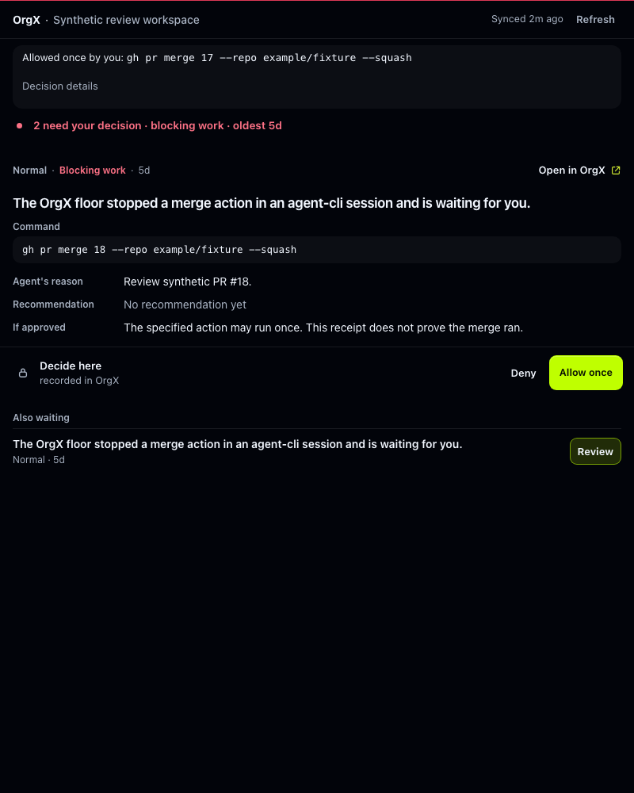
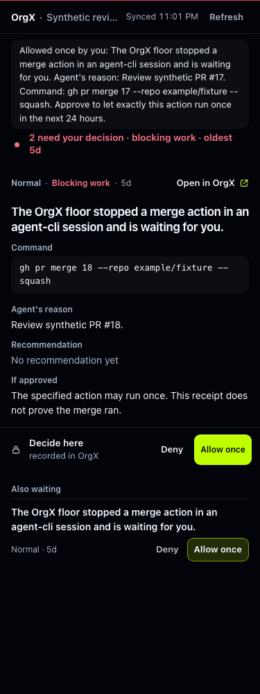
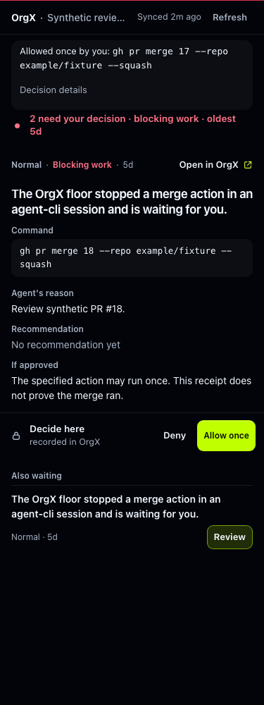
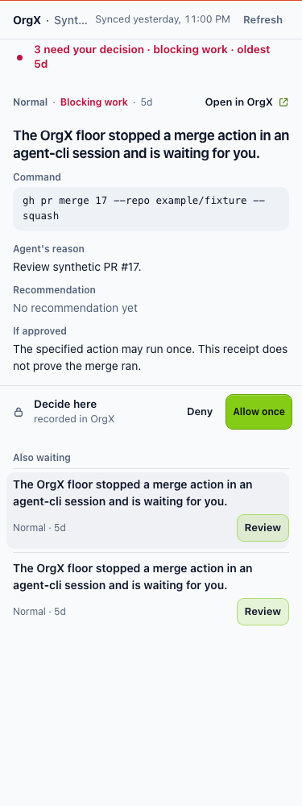
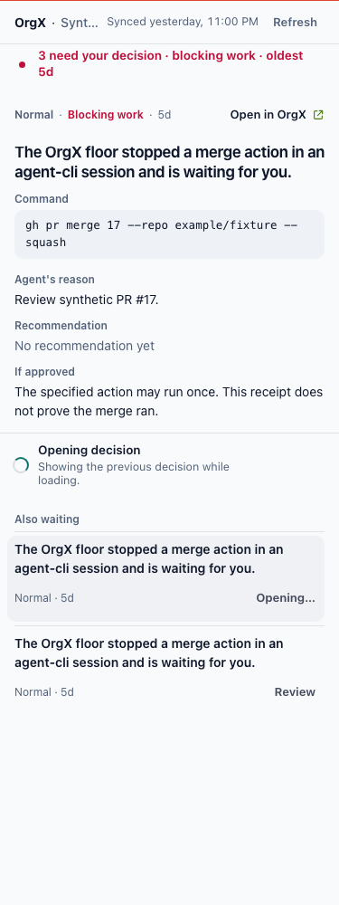

# OrgX MCP and ChatGPT experience audit — 2026-10-07

The panel made a recorded decision look confirmed before it had matching final
evidence. Workspace changes could retain drafts and receipts, while missing
metadata could retain an earlier result's approval tokens. These are the first
repairs; the screenshot's density is secondary to those trust failures.

## Evidence and limits

- Reference: user-supplied Library image `libfile_cc2877232bf08191b000d2ec7f194c65`,
  materialized and visually inspected. It shows repeated generic approval titles,
  a long last-ruling banner, a raw command, unavailable recommendation, and a
  large unaccepted-work count. Its original identity was preserved.
- Current MCP source: `397eb964390627a862063b2f783e7ed1e9cb364e`.
  [The deployment of that head succeeded](https://github.com/useorgx/orgx-mcp/actions/runs/37548333606).
  Application source: `bd51cb34c84913cc0c29ee8cbbecd2ee81b14c57`, inspected read-only.
- All new screenshots and interaction checks use the shipped HTML with an
  **offline synthetic host**, synthetic tokens, and synthetic requests. No real
  decision, command, merge, outbound message, or production record was changed.
  Native ChatGPT web/mobile was not exercised in this run.
- Supported Claude Code memory notes and repository strategy documents were
  read. The exact conversation named “plugin strategy session” was not located.
  Historical notes are intent/context, not evidence of current deployment or
  current production data.
- No paid inference or creative-model review was performed. The reported RLS
  setting on `agent_trajectory_refresh_state` was not independently investigated
  here; it is not evidence of unauthorized exposure by itself.

## Findings, ordered by impact

| Severity | Finding and evidence | Result |
| --- | --- | --- |
| P1 | Panel polling consumed MCP envelopes as plain status objects and treated missing, failed, cancelled, unrelated, or exhausted status as approval confirmation. `checkNow` also treated any final status as success. The app marks both approved and declined decisions `succeeded`. | Typed transition function derives its input type from the existing output schema. Confirmation requires matching identity, final `succeeded`, and a recognizable decision outcome. Missing/unknown outcomes stay recorded; failure/cancellation gets a failed receipt. Opposing outcomes are shown as settled in OrgX. Late automatic/manual reads cannot downgrade a final ruling. |
| P1 | Workspace switches retained local drafts, rulings, receipts, and request lifetime. Timestamp ordering could suppress the new workspace's older snapshot. | Scope changes clear local state and invalidate callbacks. The shared result gate orders timestamps within declared scope. Auth resume and cached-page reopening read state without replaying approvals. |
| P1 | A new MCP Apps result without `_meta` could inherit earlier approval metadata, including the hybrid ChatGPT fallback. | Metadata now belongs to the current result. Missing metadata clears authority. Server authorization and token checks remain the authority boundary; this is not a demonstrated server-side tenant bypass. |
| P1 | A network or unknown failure said “Nothing changed,” although a lost response cannot establish whether a write happened. | The panel asks the user to refresh and inspect the recorded outcome. Recovery never replays the ruling. The older Decisions widget still needs the same uncertainty treatment; its network error and Retry flow remain follow-up work. |
| P1 | Review had no immediate loading acknowledgement. A delayed selection left the previous approval actionable, and an older completion could flash a packet after the user had selected another item. | A typed read state acknowledges the target synchronously, blocks rulings until the read settles, coalesces repeats, discards superseded responses before token adoption, and retries the intended selection. The previous packet stays visible with explicit loading/error context. |
| P2 | Initial or malformed refresh results could leave a loading skeleton without recovery. | Required renderer fields are checked before acceptance. Failure renders an announced Refresh action and clears `aria-busy`; partial snapshots retain their available content. The server output schema remains canonical. |
| P2 | The supplied image repeats the same headline across several consequential requests with adjacent “Allow once” controls. | Duplicate headlines require Review in the queue. The detailed packet remains the ruling surface; one decision has the dominant action. The upstream question generator still needs specific action/target titles instead of the generic floor sentence. |
| P2 | The last-ruling banner repeated the entire request and command, competing with the next decision. | A compact receipt names the approved command where present; full context is reachable through a keyboard disclosure. It does not claim the authorized action executed. |
| P2 | Legacy Decisions and Artifact Review implement independent settlement logic. Artifact Review can poll indefinitely and accepts absent terminal fields. | Audited in code; left for a separate migration to shared command/run settlement rules. The new helper is deliberately limited to the panel's decision status contract. |
| P3 | Missing recommendation is truthful but unhelpful; the very large unaccepted-work count has no visible acceptance navigation in the reference. | Retained as design debt. A recommendation should explain its evidence or why it is unavailable. Acceptance needs a destination tied to the relevant work, not just an aggregate count. |

## Strategy alignment

The archived Apps SDK implementation plan describes the initial widgets,
structured payloads, resource registration, and approve/reject paths. Those are
historical plans, not a current availability checklist.

The July 2026 durable-work-record plan makes decision, why, actor, approval,
verification, receipt, and next action projections of one existing record. The
July widget redesign chooses one selected operating surface and a compressed
queue, and requires honest loading/error/partial states, disabled repeated
activation, and reduced motion. Supported Claude Code notes emphasize universal
MCP fallback and per-client conformance; they also warn that the monorepo's old
worker widgets are not the deployed source.

This repair follows that intent: approval stays separate from execution evidence,
uncertainty remains visible, and no second backend record or tool schema is added.
The original strategy's client-parity promise still needs real-host conformance
on ChatGPT web/mobile and the other clients; local fixtures do not prove it.

Sources: `hopeatina/orgx/docs/strategy/differentiation-plan-2026-07.md`,
`orgx/docs/archive/launch/chatgpt-apps-sdk-implementation-plan.md`,
`docs/review/widget-redesign-2026-07-28.md`, `docs/mcp-widget-handoff-proof-cards.md`.
Supported local memory notes: `feedback_client_parity_priority_2026-06-19`,
`project_plugin_history_severed_2026-08-06`, `project_mcp_widgets_not_deployed`,
and `project_chatgpt_app_resubmission_2026-06-10`.

### Recovered plugin intent and current measurement gaps

The June 19 Inspect-Parity build spec defines universal MCP hydration by the first
tool call, with native adapters improving that to before the first prompt. It
requires separate conformance per client, with Claude Code, Codex, Cursor, then
OpenCode as a shipping sequence. Its sub-two-second first-action bar is a
historical target; this audit has not measured authenticated production latency.
The July widget brief also asks for local acknowledgement within 400ms.

Supported memory `project_agent_coworker_os_2026-06-18` describes the original
coworker thesis: one shared graph, readable trust, and no UI narration without
ledger evidence. This repair applies that principle to packet reads and approval
receipts. The current read controller replaces unused loading and failure booleans
with one `idle | loading | failed` state, retaining the requested target. It does
not introduce another backend schema or duplicate existing tool output contracts.

The historical spec's statements that Codex has no hooks and OpenCode is absent
are not current availability claims. Current MCP source includes OpenCode
activation guidance and coverage descriptors; the supported September 26 harness
notes describe later seams. Descriptors and memories do not certify a live host.

Current `clientActivationExperience.ts` and `mcpActivationTracker.ts` call the
D1/A1/A2/A3/A4 usage sequence “Activation complete.” A4 follows structure creation,
task creation, and brief viewing. That milestone does not independently prove
July's durable continuity condition: write in session A, recover in session B,
with actor, decision, verifier, receipt, and next action intact. Keep usage,
continuity, hook coverage, and actual per-client conformance as distinct measured
claims. No production activation success rate is asserted here.

Additional source: `hopeatina/orgx/orgx/docs/strategy/inspect-parity-build-spec.md`
(June 19 historical plan); supported memories
`project_agent_coworker_os_2026-06-18` and
`reference_harness_hook_surfaces_2026-09-26`; current MCP
`src/clientActivationExperience.ts`, `src/mcpActivationTracker.ts`, and
`src/clientHookCoverage.ts`. The exact original strategy transcript remains a gap.

### Interaction speed

Four offline delayed-read cases (light/dark, 800/375px) showed local DOM
acknowledgement in 3.5–4.0ms on this machine. These samples demonstrate immediate
feedback under a deliberately unresolved tool response, not a production p95 or
end-to-end first-action measurement. Repeated Enter makes one read, a newer
selection suppresses the older packet, read failure offers a 44px Retry, and
Retry requests that same target without any write. Reduced-motion runs have no
running animations and no page errors or horizontal overflow.

## Flow and state coverage

| Step | Surface/state | Health after repair and evidence |
| --- | --- | --- |
| 1 | Disconnected, permission denied, auth pending/resume | Sign-in and handoff copy stays explicit; auth failure clears prior context. Resume is a mocked-host regression. Native OAuth consent remains untested; this implementation excludes OAuth changes. |
| 2 | Workspace selection, loading, empty | Gallery signed-out, loading, first-use, and calm fixtures captured. No-workspace source routes to OrgX. Initial and malformed failure recovery tested; packet selection now has immediate, target-specific read feedback. |
| 3 | Partial, stale, error/retry | Available proof stays visible; degraded/stale fixtures captured. Snapshot validation and lost-response recovery tested. |
| 4 | Approval pending, repeated click, cancel | One mutation for double activation; options/long/permission-limited fixtures captured. Existing composer cancellation and Escape/focus paths retained. Duplicate headlines require review. |
| 5 | Approved/rejected, status polling, execution | Matching final decision outcome confirms the ruling. Failed/cancelled/not-found, opposing or missing/unknown outcome, missing status, poll exhaustion, and automatic/manual read races are asserted. Approval of an action remains permission to run, not execution proof. |
| 6 | Success, receipt, handoff | Compact command receipt and full details captured; keyboard Enter opens disclosure. Existing deep links remain unchanged; open navigation PR #455 was inspected for overlap. |
| 7 | Races, workspace isolation, back/forward/reopen | Workspace change invalidates old completion; older cross-workspace timestamps are accepted; cached page restore re-reads without mutation. These are synthetic event tests, not native browser-history or actual account-switch certification. |
| 8 | Streaming | Existing shared live-machine/live-store tests run in the full suite. This panel is snapshot-driven; authenticated production SSE and the older artifact-review timeout are not newly verified. |

## Screenshots

All four are inspected synthetic captures of the shipped panel, with identical
fixtures before/after. The displayed command is never executed.

Additional read-selection captures compare the earlier draft head
`039d29ae494f1fabef71372f5f2bfd9fd2d95493` with this revision:

## Verification

- Initial experience regressions against original main: **10 failed, 1 passed**;
  failures reproduce the defects rather than merely mirror the implementation.
- Full local suite: **241 files passed, 1 skipped; 2,584 tests passed, 2 skipped**.
  Type-check and production bundle build passed. A final generated-assets/payload
  and experience check passed 83 focused tests. Three browser suites required macOS process-launch permission; their nine cases passed on rerun. Exact-head CI results are recorded in the PR.
- Offline browser audit: four theme/viewport pairs at 800px and 375px, one
  synthetic mutation per click, zero page errors/overflow/running reduced-motion
  animations, keyboard disclosure; ten additional phone state captures. A lost
  response fixture checks a 44px Refresh target, keyboard recovery, and no replay.
- Existing panel theme audit: **8/8** light/dark desktop/tablet/phone/200% zoom
  cases passed; zero visible targets below 44px. Sampled text/token contrast
  minima were 4.92 in light and 6.10 in dark. This is not full WCAG certification
  or a screen-reader audit.
- Reproduce with `node scripts/audit-panel-experience.mjs`,
  `node scripts/audit-panel-read-interaction.mjs`, and
  `WIDGET_THEME_WIDGETS=orgx-panel WIDGET_THEME_EVIDENCE_DIR=artifacts/qa/panel-theme node scripts/audit-widget-themes.mjs`.

No merge, deployment, permission change, production business write, or real
outbound action is authorized by this audit. Homepage, broker, runtime config,
and the open OAuth/directory/navigation work remain outside this implementation.
