# OrgX panel on every host and on a phone — 2026-10-09

The panel (`ui://widget/orgx-panel.html`) was written for ChatGPT's sidebar and
said so in its copy: "Ask ChatGPT", "Connect OrgX in ChatGPT", "ChatGPT is
taking it to OrgX". The same document renders inside Claude on the desktop
and on a phone, and inside any MCP Apps host, where that copy is wrong and the
layout knew nothing about the device. This pass makes the panel host-aware and
phone-aware, and gives the two states a phone meets most, a slow cold start and
a dropped network, an honest shape.

## What changed

| Area | Before | After |
| --- | --- | --- |
| Host copy | Every surface named ChatGPT. | `shared/panel/panel-host.js` resolves the host from `window.openai`, the `ui/initialize` `hostInfo`, the host context `userAgent`, or the web view's UA. Copy names ChatGPT, Claude, Cursor, VS Code, Codex, Gemini or Goose, and falls back to "the chat" / "the assistant" when it cannot tell. The asks row, share hint, stale-tools notice, workspace switcher, Start, receipts and the tour all follow. |
| Not connected | One line and an Open OrgX button. | A connect card: the host's name in the title, three numbered steps (add the connector in that host's settings, choose Read or Operate, check again), an "I've connected it" button that reads again with the skeleton while it runs, and a scope variant when the grant is too narrow. |
| Cold start | Skeleton with one caption, forever. | The caption escalates: "Reading your workspace" → after 6s "Still reading. OrgX is taking longer than usual." → after 15s "OrgX hasn't answered yet." with Try again and Open OrgX. `aria-busy` stays true; the escalation stops the moment a snapshot or an auth answer lands. |
| Offline | Nothing. | `navigator.onLine` and the `online`/`offline` events: an amber notice over the last snapshot with its time, a different caption on a cold start, and one read when the network returns. |
| Phone layout | Container queries only. | `data-platform`, `data-touch`, `data-display-mode` on `<html>` and `--pn-safe-*` from the host's `safeAreaInsets` (with `env(safe-area-inset-*)` as the floor). Row actions do not wait for a hover on touch. |
| Full screen | None. | On a phone, when the host lists `fullscreen` in `availableDisplayModes`, a header button asks for it through `requestDisplayMode` and turns into a Back-to-the-chat button once there. Never shown in a sidebar or on the desktop. |
| Swipe | None. | On touch, a horizontal swipe across the view moves one tab in the tabs' own order, with the existing directional view transition. Vertical scrolling, text fields, the tab strip and the rows that scroll sideways are left alone. Mouse pointers never swipe. |
| Haptics | None. | A short vibration when a ruling settles, a different one when it fails. Touch devices only, never under reduced motion. |

Nothing here changes a tool, a schema, or a server route. The panel's payload
budget grew by one module (`scripts/widget-payload-budgets.json`:
703,488 → 720,896 bytes).

## ChatGPT's phone app: the host's bars cover the panel

Real captures from the ChatGPT iOS app (below) showed what the synthetic host
could not: in the full-screen app view, ChatGPT's own title bar sits over the
panel's header and tabs, and its composer sits over the bottom, hiding the
queue and even the tour's Skip / Back / Next buttons. The Apps SDK reports
how much it covers in `window.openai.safeArea.insets`, with changes on the
`openai:set_globals` event, and says what device it is on in
`window.openai.userAgent`. The host module now reads both, so the panel pads
its top and bottom by those insets, the tour places its card and scrolls its
target inside the open area, and the tabs stay reachable. The tour also said
"Seven short steps", showed eight dots and counted "of 6"; it is now six
numbered steps everywhere.

| Real ChatGPT iOS (before) | Simulated, before | Simulated, after |
| --- | --- | --- |
| 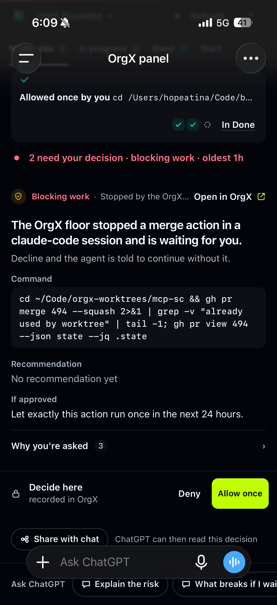 | 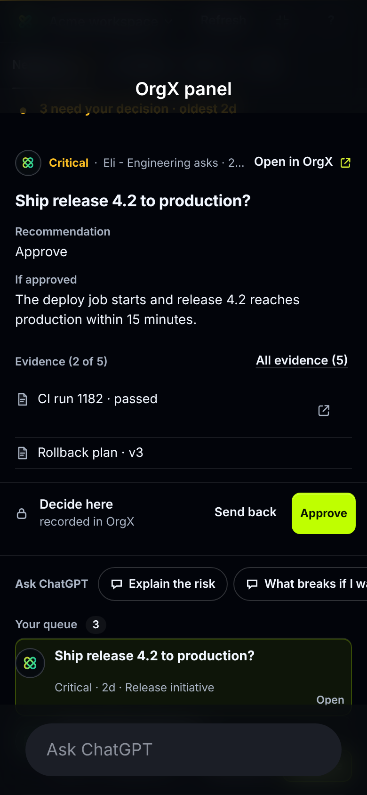 | 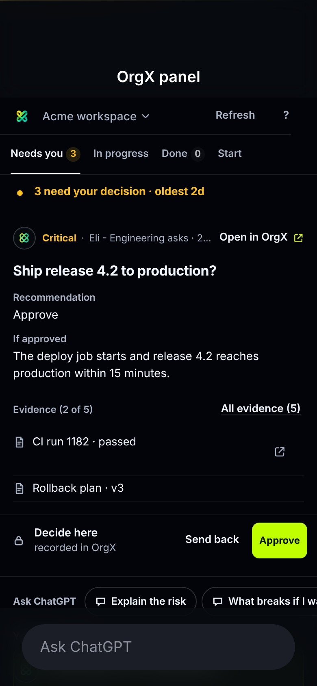 |
| 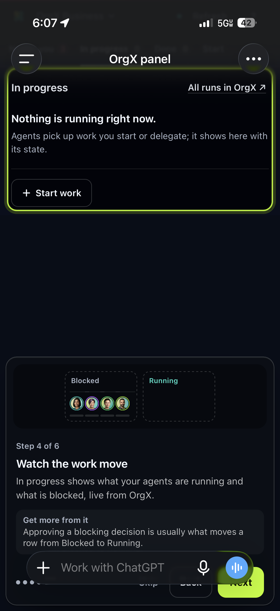 | 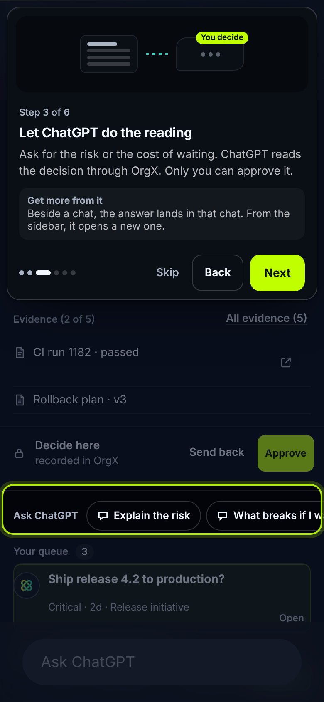 | 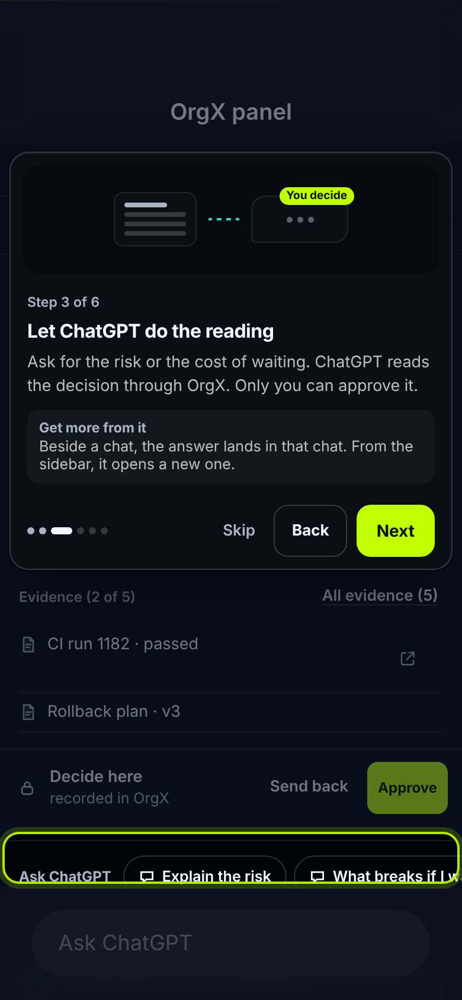 |

The simulation draws a 120px title bar and a 96px composer over the gallery
panel and reports the same insets to it (`?safe=120,0,96,0`). The exact
values ChatGPT reports on a given phone come from the app at runtime.

## Host resolution

MCP Apps hosts identify themselves in the `ui/initialize` response
(`hostInfo.name`); ext-apps 1.1.2 keeps that private, so the module reads the
parent's response the same way `openai-extensions.js` reads
`hostCapabilities`. Only the parent window is trusted. The host context's
`userAgent`, `platform`, `deviceCapabilities`, `displayMode`,
`availableDisplayModes` and `safeAreaInsets` are read on connect and on every
`host-context-changed`. In the local preview (`?gallery=true`), `host=`,
`platform=`, `modes=`, `display=`, `stage=` and `offline=1` stand in for what a
host would send.

## Evidence

Offline synthetic captures of the shipped HTML at 390×844 (2×), the gallery
fixtures, no OrgX behind them. The before set is `main` at `7692702`.

| | Before | After |
| --- | --- | --- |
| Not connected | 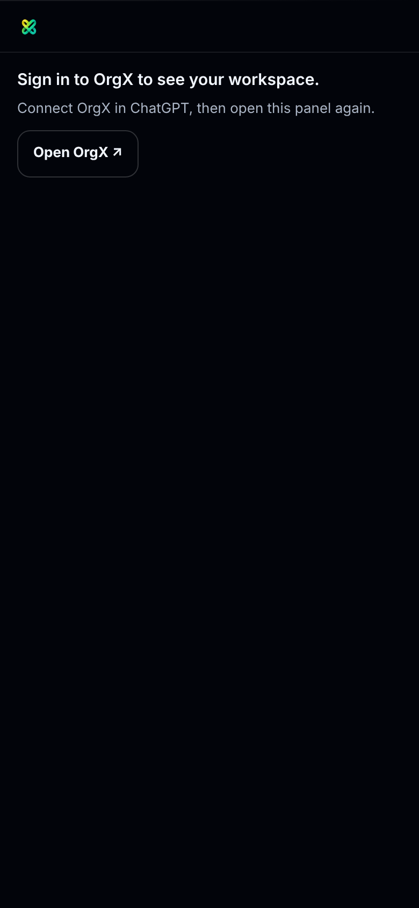 | 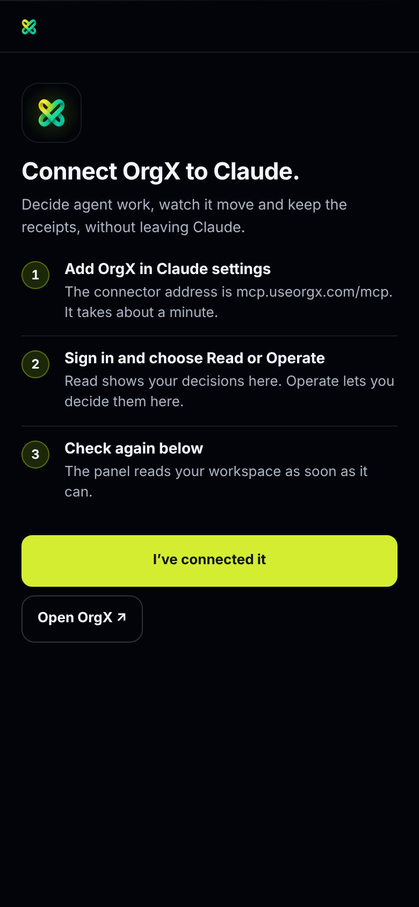 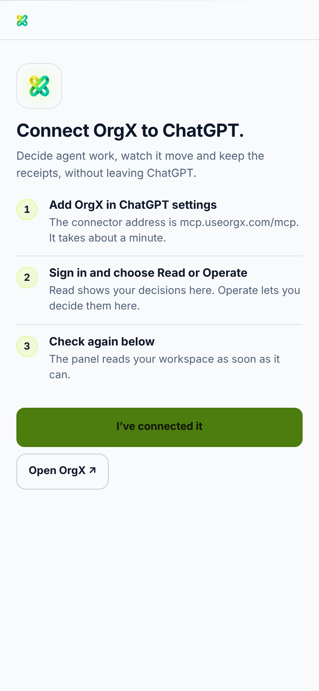 |
| Cold start |  | 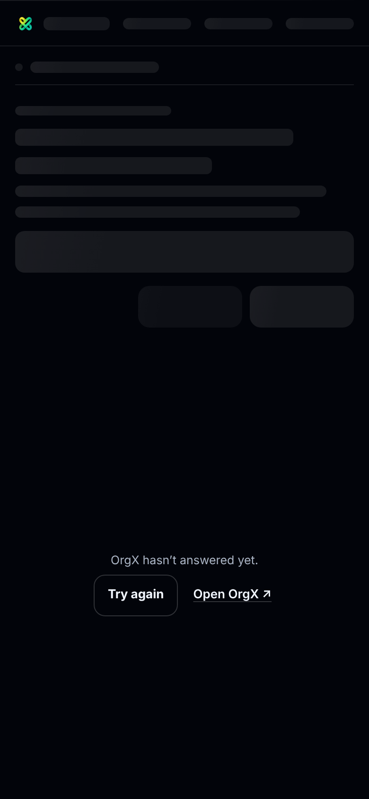 |
| Needs you | 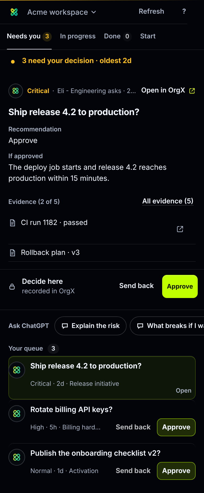 | 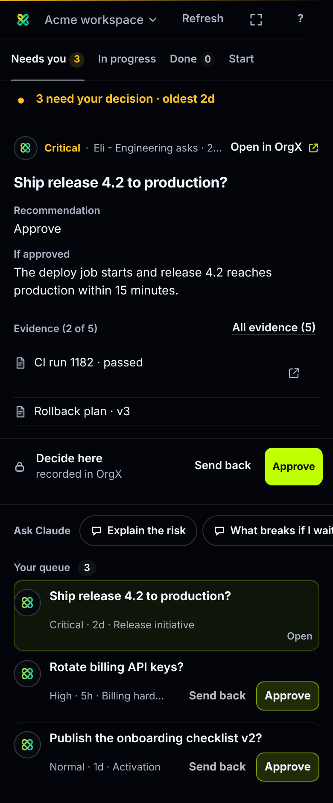 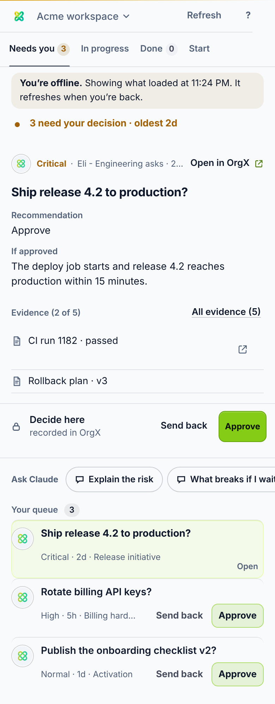 |

Every capture: no horizontal overflow, no page errors, both themes.

## Verification

- `tests/panelHost.spec.ts` (new): host naming from `userAgent` and from
  `hostInfo` (with the re-render when it arrives), the unknown-host fallback,
  platform/touch/safe-area attributes, the full-screen toggle (shown on a phone
  only, asks the host, flips to Back), swipe between tabs and the vertical and
  mouse cases that must not, the connect card and its read-again button, the
  scope variant, the cold-start escalation and its recovery, and offline over a
  snapshot and over a cold start.
- `tests/panelReceipts.spec.ts` and `tests/panelExtensionCompatibility.spec.ts`
  now identify the host before asserting ChatGPT wording.
- Full `vitest run`, `tsc --noEmit` and `pnpm widget:build` pass; see the pull
  request for the counts.

## Not done here

- Claude mobile was not exercised; its captures use a synthetic host. Real
  `hostInfo.name` values should be confirmed on each host and added to the
  test fixtures. ChatGPT iOS was seen before this change only; the after
  state there is the simulation above.
- The consent page (`public/consent.html`) already has 860px and 520px
  breakpoints and was not changed.
- The older Decisions and Artifact Review widgets still say "ChatGPT" in a few
  places and do not use the host module yet.
