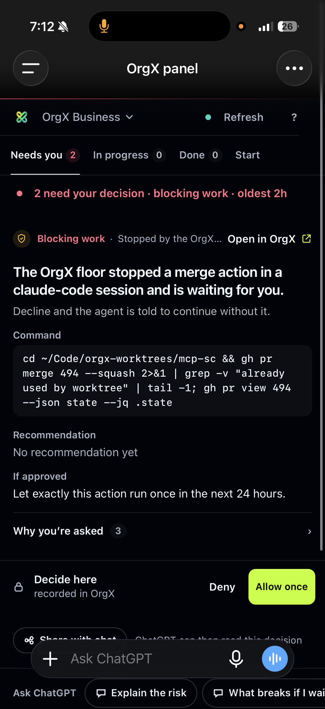
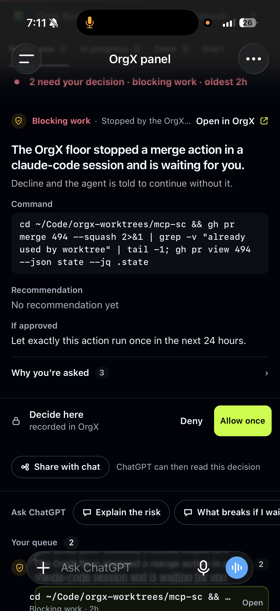
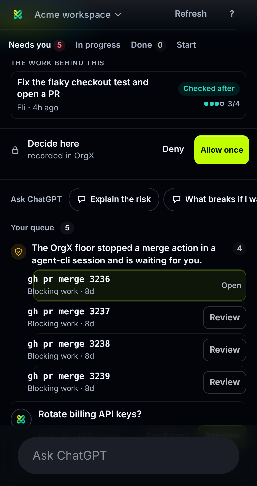
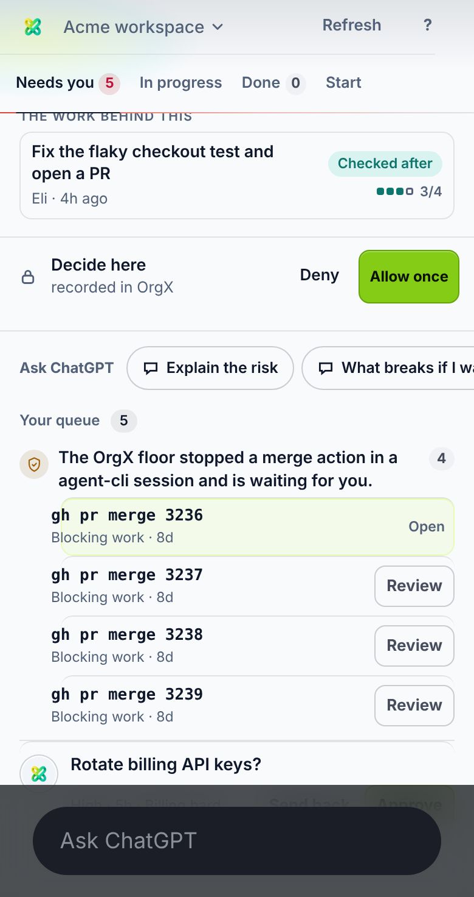
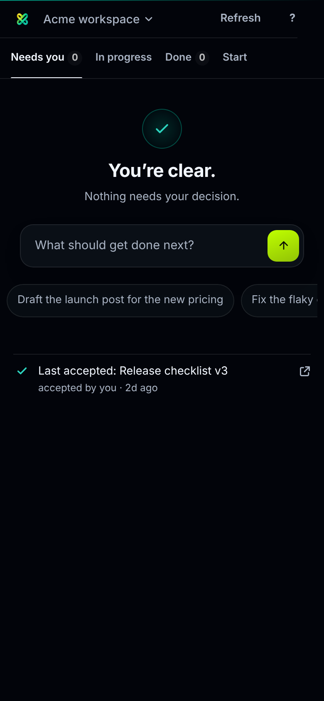
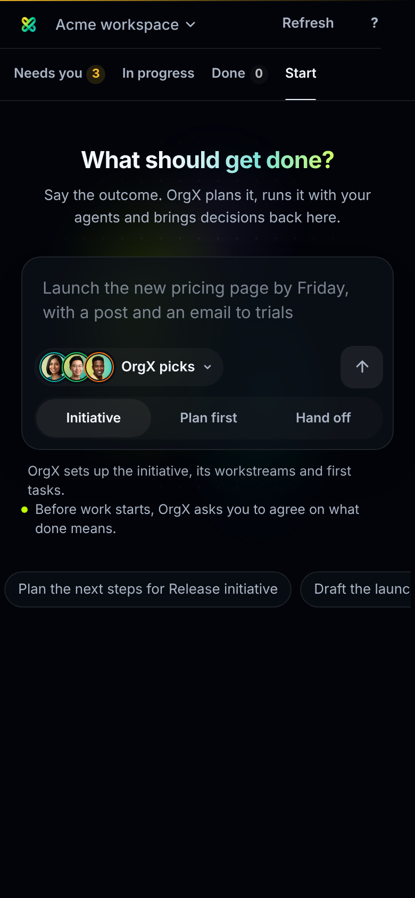
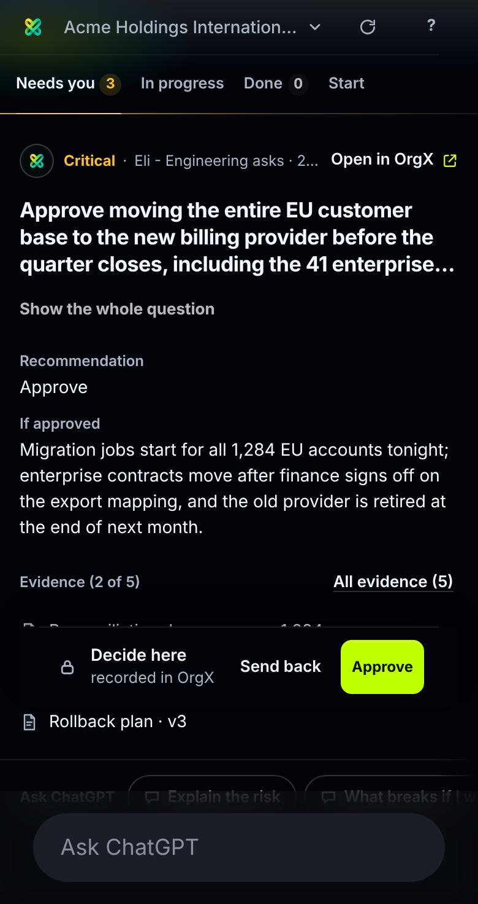

# OrgX panel on every host and on a phone — 2026-10-09

The panel (`ui://widget/orgx-panel.html`) was written for ChatGPT's sidebar and
said so in its copy: "Ask ChatGPT", "Connect OrgX in ChatGPT", "ChatGPT is
taking it to OrgX". The same document renders inside Claude on the desktop
and on a phone, and inside any MCP Apps host, where that copy is wrong and the
layout knew nothing about the device. This pass makes the panel host-aware and
phone-aware, and gives the two states a phone meets most, a slow cold start and
a dropped network, an honest shape.

## What changed

| Area | Before | After |
| --- | --- | --- |
| Host copy | Every surface named ChatGPT. | `shared/panel/panel-host.js` resolves the host from `window.openai`, the `ui/initialize` `hostInfo`, the host context `userAgent`, or the web view's UA. Copy names ChatGPT, Claude, Cursor, VS Code, Codex, Gemini or Goose, and falls back to "the chat" / "the assistant" when it cannot tell. The asks row, share hint, stale-tools notice, workspace switcher, Start, receipts and the tour all follow. |
| Not connected | One line and an Open OrgX button. | A connect card: the host's name in the title, three numbered steps (add the connector in that host's settings, choose Read or Operate, check again), an "I've connected it" button that reads again with the skeleton while it runs, and a scope variant when the grant is too narrow. |
| Cold start | Skeleton with one caption, forever. | The caption escalates: "Reading your workspace" → after 6s "Still reading. OrgX is taking longer than usual." → after 15s "OrgX hasn't answered yet." with Try again and Open OrgX. `aria-busy` stays true; the escalation stops the moment a snapshot or an auth answer lands. |
| Offline | Nothing. | `navigator.onLine` and the `online`/`offline` events: an amber notice over the last snapshot with its time, a different caption on a cold start, and one read when the network returns. |
| Phone layout | Container queries only. | `data-platform`, `data-touch`, `data-display-mode` on `<html>` and `--pn-safe-*` from the host's `safeAreaInsets` (with `env(safe-area-inset-*)` as the floor). Row actions do not wait for a hover on touch. |
| Full screen | None. | On a phone, when the host lists `fullscreen` in `availableDisplayModes`, a header button asks for it through `requestDisplayMode` and turns into a Back-to-the-chat button once there. Never shown in a sidebar or on the desktop. |
| Swipe | None. | On touch, a horizontal swipe across the view moves one tab in the tabs' own order, with the existing directional view transition. Vertical scrolling, text fields, the tab strip and the rows that scroll sideways are left alone. Mouse pointers never swipe. |
| Haptics | None. | A short vibration when a ruling settles, a different one when it fails. Touch devices only, never under reduced motion. |

Nothing here changes a tool, a schema, or a server route. The panel's payload
budget grew by one module (`scripts/widget-payload-budgets.json`:
703,488 → 720,896 bytes).

## ChatGPT's phone app: the host's bars cover the panel

Real captures from the ChatGPT iOS app (below) showed what the synthetic host
could not: in the full-screen app view, ChatGPT's own title bar sits over the
panel's header and tabs, and its composer sits over the bottom, hiding the
queue and even the tour's Skip / Back / Next buttons. The Apps SDK reports
how much it covers in `window.openai.safeArea.insets`, with changes on the
`openai:set_globals` event, and says what device it is on in
`window.openai.userAgent`. The host module now reads both, so the panel pads
its top and bottom by those insets, the tour places its card and scrolls its
target inside the open area, and the tabs stay reachable. The tour also said
"Seven short steps", showed eight dots and counted "of 6"; it is now six
numbered steps everywhere.

| Real ChatGPT iOS (before) | Simulated, before | Simulated, after |
| --- | --- | --- |
|  |  |  |
|  |  |  |

The simulation draws a 120px title bar and a 96px composer over the gallery
panel and reports the same insets to it (`?safe=120,0,96,0`). The exact
values ChatGPT reports on a given phone come from the app at runtime.

### What the second set of captures settled: the host owns the top

A second set of real captures (below) showed the panel at scroll top with
its header right under ChatGPT's bar, and the header gone only once the view
had scrolled under the translucent bar. So ChatGPT starts a full-screen
app's content below its own bar; the top needs no padding from the panel,
and an earlier 110px top floor was removed (it would have doubled the gap).
The composer, by contrast, is drawn over the bottom of the view.

What the panel does now:

- **A pinned header.** On a phone the header (mark, workspace selector,
  Refresh, help, the tab row) is `position: sticky` at the top of the open
  area, so it sits right under the host's bar and stays there however far
  the view scrolls. Its offset is whatever the host reports (its insets, or
  the device's safe area; `viewport-fit=cover` lets `env()` carry a bar the
  view sits under), and zero when the host already starts the content below
  its bar. Its background continues the fade the host's bar has, with the
  brand's light behind the mark, and the state's edge (calm, needs you,
  blocking) runs along its bottom instead of the panel's top.
- **A composer floor.** Inside ChatGPT, on a phone, in a view that fills the
  screen, with no insets reported, the panel keeps 92px clear at the bottom
  (composer plus home indicator, measured on an iPhone with a Dynamic
  Island). Reported insets always win; inline views, desktops and other
  hosts never get it. `data-safe-source` on `<html>` says which applied.

`tests/panelPhoneChrome.spec.ts` verifies the outcome rather than the CSS:
it runs the shipped panel in Chromium at 390×844 under a synthetic
`window.openai`, draws ChatGPT's chrome as pointer-blocking overlays, and
taps the controls at their on-screen coordinates. A tap that lands on the
chrome fails the test. Two host behaviours: the bar drawn over the view with
insets reported, and the content started below the bar with nothing
reported. In both: the mark, the workspace name and all four tabs are
tappable; after scrolling 600px the header is still at the top of the open
area and the Start tab still switches; the connect card's button can be
pressed and the read follows; the tour card and its Next button stay above
the composer through four steps. A canary case confirms the harness sees a
bar cover the tabs when nothing keeps the panel out from under it.

| Real ChatGPT iOS, scroll top | Real ChatGPT iOS, scrolled (before) | Simulated, scrolled (after) |
| --- | --- | --- |
|  |  |  |

The host's title now reads "OrgX" (the widget resource title); the panel's
own header shows the mark and the workspace, never the word again.

## Borrowed from the other apps, and the real mark

Canva, Runway and Figma in ChatGPT's phone app set the bar: a headline that
wears the brand, a horizontal rail of concrete ways in, a quiet centred
brand mark while loading. Three changes follow them.

| | What |
| --- | --- |
| Cold start | The skeleton rows are gone. The real OrgX mark settles in the middle of the open view, one thin light sweeps around it, and four lights in the agent domains' tints orbit it while the workspace is read. The caption underneath still escalates (slow, stalled, offline). When the first snapshot lands the stage falls away and the content rises in its place (a view transition; a cut under reduced motion). |
| Ways in | The calm and first-use states carry a rail of four jobs under the prompt, scroll-snapped edge to edge on a phone. A tap opens Start with the words already in the box, who takes it chosen, and the exact sentence shown. Start's own Try row becomes the same rail on a phone. The Start question and the first-use headline wear a light gradient from the text colour into teal and lime. |
| The mark | Every `<ox-avatar>` that stands for OrgX itself (system, automation, no owner), including the decision rows and the Decisions widget, drew an approximation of the mark as SVG paths from the UI kit. `agent-identity.js` now swaps in the real ribbon mark (the same inlined WebP the panel header uses) once the avatar renders, across every widget. The kit itself is vendored and untouched. |

The real mark adds 4.7 KB to every widget that inlines `agent-identity.js`;
the payload budgets were regenerated with `pnpm widget:payload --update`.

## Feel: the audit pass

Every view was captured at phone size (Needs you with short and long packets,
send-back, In progress and its detail card, Done and a receipt, Start and its
who-menu, the workspace switcher, the agreement bar) and read against the
design system. The structure held; what was missing was feel. The ask chips
already use the host's native path (MCP Apps `sendMessage`, else ChatGPT's
`sendFollowUpMessage`), the same mechanism Canva's chips use, so a tap puts
the sentence into the chat and the host answers in its own sheet.

| | Before | After |
| --- | --- | --- |
| Deciding a long packet | Approve and Send back scrolled away under the packet. | On a phone the footer floats at the bottom of the view, above the composer, while the packet's end is below the view; once the end scrolls in, it settles back into place. The packet keeps the footer's height meanwhile, so nothing jumps. |
| Coming back to a tab | Every switch landed at the top. | Each tab remembers its scroll position and returns there. |
| The tab underline | Blinked out and in. | Travels between tabs as one piece (a view-transition name on the selected tab's underline). |
| Pressing things | Nothing moved under the finger. | Chips, rows, buttons and tabs settle slightly on press; a tab tap and a sent chip tick on the haptic motor; a sent chip pops with a check. |
| Refresh | The word, taking width from the workspace name. | An icon that spins while the read is in flight; the word returns on wide panels and stays for screen readers. |
| Rows that scroll sideways | A chip cut at the edge read as a bug. | The edge fades, so the cut reads as "more". |

`tests/panelPhoneChrome.spec.ts` checks the floating footer on a tall
packet (tappable, above the composer, in view after a scroll) in both host
behaviours; `tests/panelPolish.spec.ts` checks the scroll memory and the busy
refresh icon.

## Host resolution

MCP Apps hosts identify themselves in the `ui/initialize` response
(`hostInfo.name`); ext-apps 1.1.2 keeps that private, so the module reads the
parent's response the same way `openai-extensions.js` reads
`hostCapabilities`. Only the parent window is trusted. The host context's
`userAgent`, `platform`, `deviceCapabilities`, `displayMode`,
`availableDisplayModes` and `safeAreaInsets` are read on connect and on every
`host-context-changed`. In the local preview (`?gallery=true`), `host=`,
`platform=`, `modes=`, `display=`, `stage=` and `offline=1` stand in for what a
host would send.

## Evidence

Offline synthetic captures of the shipped HTML at 390×844 (2×), the gallery
fixtures, no OrgX behind them. The before set is `main` at `7692702`.

| | Before | After |
| --- | --- | --- |
| Not connected |  |   |
| Cold start |  |  |
| Needs you |  |   |

Every capture: no horizontal overflow, no page errors, both themes.

## Verification

- `tests/panelPhoneChrome.spec.ts` (new, Chromium): the hit-test verification above.
- `tests/panelPolish.spec.ts` (new): the boot stage and its hand-off to content,
  the real mark on every OrgX avatar, and the calm rail opening Start.
- `tests/panelHost.spec.ts` (new): host naming from `userAgent` and from
  `hostInfo` (with the re-render when it arrives), the unknown-host fallback,
  platform/touch/safe-area attributes, the full-screen toggle (shown on a phone
  only, asks the host, flips to Back), swipe between tabs and the vertical and
  mouse cases that must not, the connect card and its read-again button, the
  scope variant, the cold-start escalation and its recovery, and offline over a
  snapshot and over a cold start.
- `tests/panelReceipts.spec.ts` and `tests/panelExtensionCompatibility.spec.ts`
  now identify the host before asserting ChatGPT wording.
- Full `vitest run`, `tsc --noEmit` and `pnpm widget:build` pass; see the pull
  request for the counts.

## Not done here

- Claude mobile was not exercised; its captures use a synthetic host. Real
  `hostInfo.name` values should be confirmed on each host and added to the
  test fixtures. ChatGPT iOS was seen before this change only; the after
  state there is the simulation above.
- The consent page (`public/consent.html`) already has 860px and 520px
  breakpoints and was not changed.
- The older Decisions and Artifact Review widgets still say "ChatGPT" in a few
  places and do not use the host module yet.
